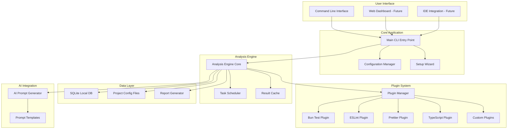
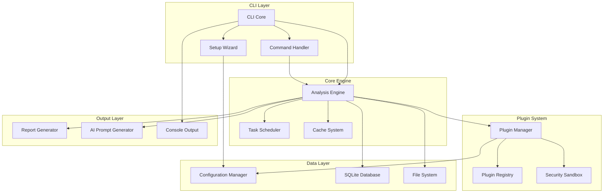
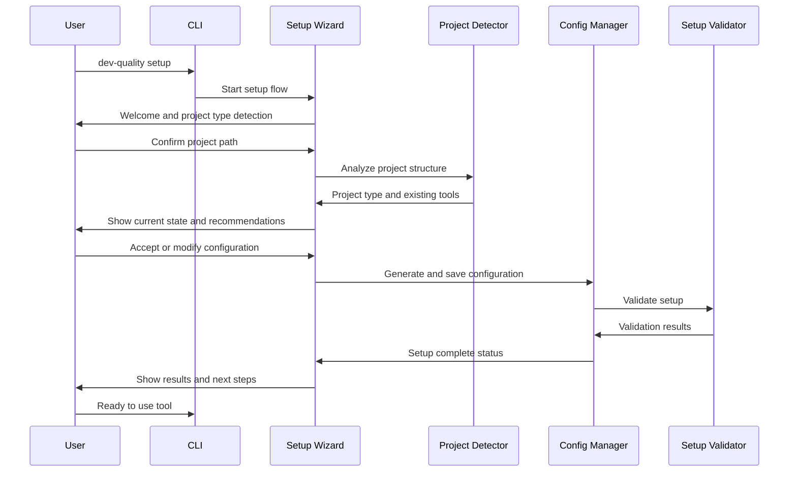
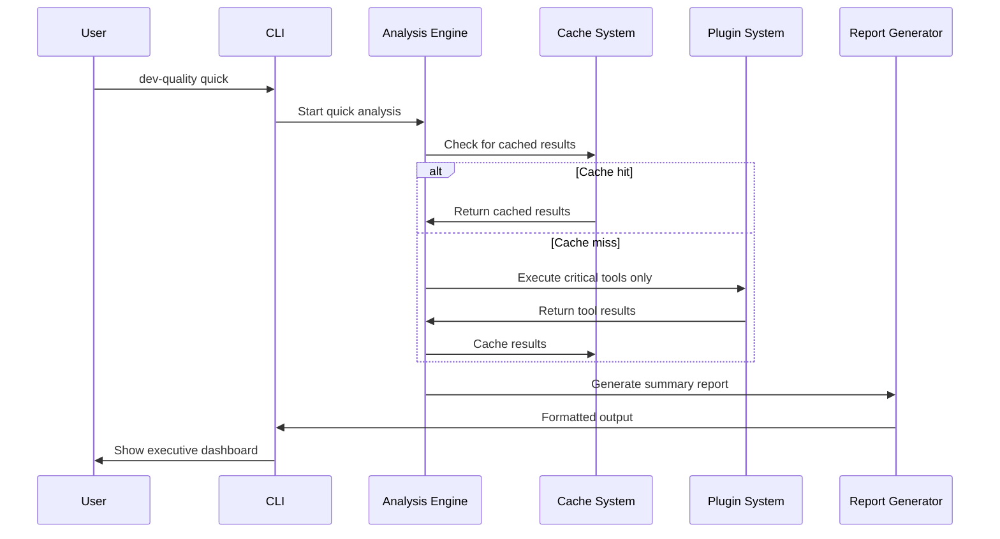
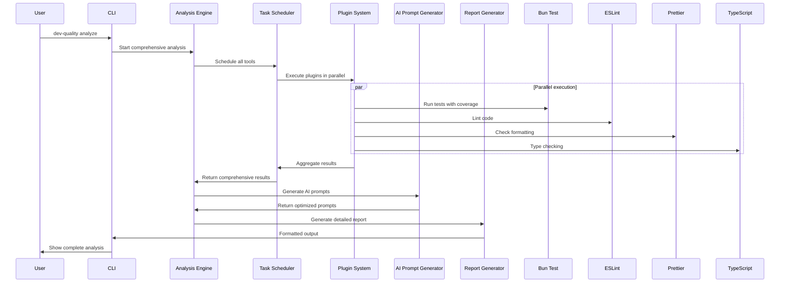
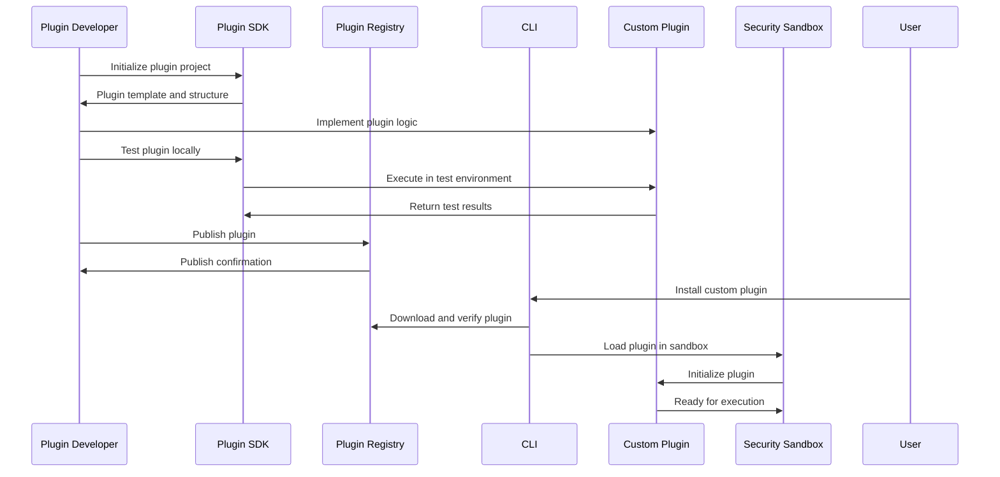
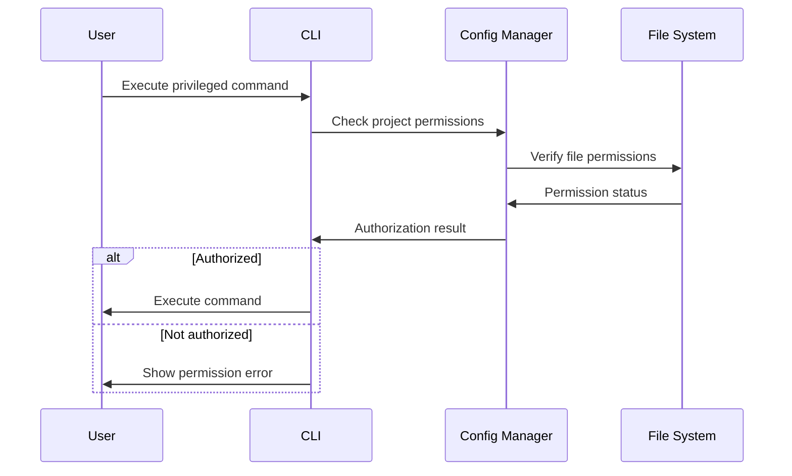
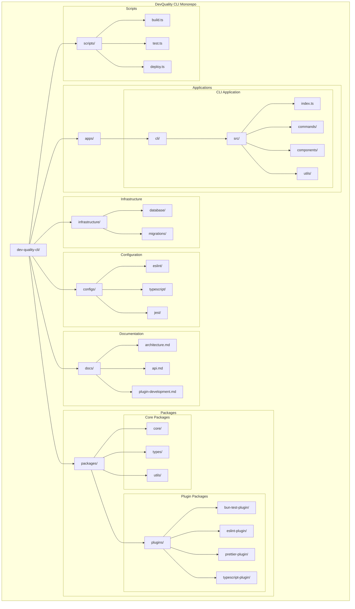
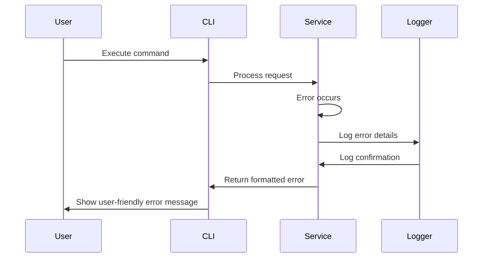

# DevQuality CLI Fullstack Architecture Document

## Introduction

This document outlines the complete fullstack architecture for DevQuality CLI, including CLI interface, backend analysis engine, and potential future web components. It serves as the single source of truth for AI-driven development, ensuring consistency across the entire technology stack.

This unified approach combines CLI tooling with extensible architecture for future GUI components, streamlining the development process for modern developer tools that bridge command-line and web interfaces.

### Starter Template or Existing Project

**N/A - Greenfield CLI Project**

This is a new CLI tool project designed from scratch with modern TypeScript/Bun tooling. No existing starter templates or legacy codebases are being used, allowing for optimal architecture decisions without migration constraints.

### Change Log

| Date       | Version | Description                             | Author              |
| ---------- | ------- | --------------------------------------- | ------------------- |
| 2025-09-28 | v1.0    | Initial fullstack architecture creation | Winston (Architect) |

## High Level Architecture

### Technical Summary

DevQuality CLI is a modern command-line tool built with TypeScript and Bun, featuring an event-driven plugin architecture for extensible quality analysis. The tool integrates multiple quality checking systems (Bun test, ESLint, Prettier, TypeScript) into a unified analysis engine with both immediate CLI feedback and extensible web-based reporting capabilities. The architecture supports rapid setup through intelligent project detection and provides comprehensive insights through AI-optimized prompt generation.

### Platform and Infrastructure Choice

**Platform:** Local-first CLI with optional cloud components for enhanced features
**Key Services:** Local analysis engine with optional cloud-based reporting and collaboration features
**Deployment Host and Regions:** N/A (CLI tool distributed via npm registry)

**Platform Decision Rationale:**

- **Local-first**: CLI tool prioritizes developer privacy and offline capability
- **NPM Distribution**: Leverages existing package manager ecosystem
- **Optional Cloud**: Web components are additive, not required for core functionality
- **Cross-platform**: Native performance on macOS, Linux, and Windows

### Repository Structure

**Structure:** Monorepo with clear package boundaries
**Monorepo Tool:** npm workspaces (simple, native, no additional tooling overhead)
**Package Organization:** Core CLI, analysis engine, plugins, and potential web interface as separate packages

**Repository Strategy Rationale:**

- **Monorepo**: Enables tight integration between CLI and analysis components
- **npm workspaces**: Simplifies dependency management and cross-package development
- **Clear boundaries**: Core CLI logic separate from extensible analysis plugins
- **Future-ready**: Accommodates web interface expansion without architectural changes

### High Level Architecture Diagram



### Architectural Patterns

- **Event-Driven Architecture**: Plugin system uses event bus for loose coupling between analysis tools
- **Repository Pattern**: Abstracts data access for configuration and results storage
- **Strategy Pattern**: Different analysis tools implement common interfaces for consistent execution
- **Command Pattern**: CLI commands encapsulate analysis operations with undo/redo capability
- **Observer Pattern**: Real-time progress updates and result streaming
- **Template Method**: Standardized analysis workflow with tool-specific implementations
- **Dependency Injection**: Modular component architecture with clear interface contracts

## Tech Stack

### Technology Stack Table

| Category             | Technology       | Version | Purpose                               | Rationale                                                      |
| -------------------- | ---------------- | ------- | ------------------------------------- | -------------------------------------------------------------- |
| **Language**         | TypeScript       | 5.3.3   | Primary development language          | Strong typing, excellent tooling, wide ecosystem support       |
| **Runtime**          | Bun              | 1.0.0   | JavaScript runtime and bundler        | Lightning fast execution, built-in test runner, modern tooling |
| **CLI Framework**    | Commander.js     | 11.0.0  | Command parsing and interface         | Mature, well-documented, extensible CLI framework              |
| **Interactive UI**   | Ink              | 4.0.0   | Terminal-based interactive components | React components for CLI, rich terminal interfaces             |
| **State Management** | Zustand          | 4.4.0   | CLI state management                  | Lightweight, simple API, TypeScript-first                      |
| **API Style**        | CLI Commands     | -       | Primary interface                     | Direct command execution for optimal performance               |
| **Database**         | SQLite           | 5.1.0   | Local caching and historical data     | Zero-config, file-based, no external dependencies              |
| **Cache**            | Memory + SQLite  | -       | Multi-layer caching strategy          | Fast in-memory cache with persistent SQLite backup             |
| **File Storage**     | Local Filesystem | -       | Configuration and report storage      | No external dependencies, user control over data               |
| **Authentication**   | Local Auth       | -       | Security for sensitive operations     | Local-only operation minimizes security surface                |
| **Frontend Testing** | Vitest           | 1.0.0   | Unit and integration testing          | Fast, modern testing with great TypeScript support             |
| **Backend Testing**  | Bun Test         | 1.0.0   | Test execution and coverage analysis  | Integrated with Bun, fast execution                            |
| **E2E Testing**      | N/A              | -       | CLI tool validation                   | Manual testing with shell commands for validation              |
| **Build Tool**       | Bun              | 1.0.0   | Build and bundling                    | Integrated with runtime, fast builds                           |
| **Bundler**          | Bun              | 1.0.0   | Package bundling                      | Native bundling with optimal performance                       |
| **IaC Tool**         | N/A              | -       | No infrastructure required            | CLI tool runs locally without cloud infrastructure             |
| **CI/CD**            | GitHub Actions   | -       | Automated testing and deployment      | GitHub-native, excellent community support                     |
| **Monitoring**       | Winston          | 3.11.0  | Logging and debugging                 | Simple, extensible logging for CLI applications                |
| **Logging**          | Winston          | 3.11.0  | Structured logging                    | JSON format with configurable levels and outputs               |
| **CSS Framework**    | N/A              | -       | No CSS required                       | CLI interface uses text-based styling                          |

**Technology Selection Notes:**

- Bun provides integrated testing, bundling, and runtime for optimal performance
- TypeScript ensures type safety across the entire codebase
- Commander.js offers mature CLI parsing with extensive customization
- Ink enables rich terminal interfaces using React components
- SQLite provides zero-configuration local data persistence
- npm workspaces simplify monorepo management without additional tooling

## Data Models

### ProjectConfiguration

**Purpose:** Stores project-specific configuration and detected settings

**Key Attributes:**

- projectPath: string - Absolute path to project root
- projectType: 'javascript' | 'typescript' | 'mixed' - Detected project language
- tools: ToolConfiguration[] - Configured analysis tools
- settings: UserSettings - User preferences and options
- lastAnalysis: AnalysisResult | null - Cached last analysis results
- createdAt: Date - Configuration creation timestamp
- updatedAt: Date - Last modification timestamp

**TypeScript Interface:**

```typescript
interface ProjectConfiguration {
  projectPath: string;
  projectType: "javascript" | "typescript" | "mixed";
  tools: ToolConfiguration[];
  settings: UserSettings;
  lastAnalysis?: AnalysisResult;
  createdAt: Date;
  updatedAt: Date;
}
```

**Relationships:**

- Has many ToolConfiguration records
- Has one UserSettings
- References many AnalysisResult records

### ToolConfiguration

**Purpose:** Individual tool configuration and settings

**Key Attributes:**

- toolName: string - Name of the analysis tool (eslint, prettier, etc.)
- enabled: boolean - Whether the tool is active
- configPath: string - Path to configuration file
- version: string - Tool version
- options: Record<string, any> - Tool-specific settings
- lastRun: Date | null - Last execution timestamp
- status: 'active' | 'error' | 'disabled' - Current tool status

**TypeScript Interface:**

```typescript
interface ToolConfiguration {
  toolName: string;
  enabled: boolean;
  configPath: string;
  version: string;
  options: Record<string, any>;
  lastRun?: Date;
  status: "active" | "error" | "disabled";
}
```

**Relationships:**

- Belongs to ProjectConfiguration
- Has many AnalysisResult records

### AnalysisResult

**Purpose:** Stores comprehensive analysis results from tool execution

**Key Attributes:**

- id: string - Unique result identifier
- projectId: string - Associated project identifier
- timestamp: Date - Analysis execution time
- duration: number - Execution duration in milliseconds
- overallScore: number - Overall quality score (0-100)
- toolResults: ToolResult[] - Individual tool results
- summary: ResultSummary - Aggregated metrics and insights
- aiPrompts: AIPrompt[] - Generated AI prompts for improvements

**TypeScript Interface:**

```typescript
interface AnalysisResult {
  id: string;
  projectId: string;
  timestamp: Date;
  duration: number;
  overallScore: number;
  toolResults: ToolResult[];
  summary: ResultSummary;
  aiPrompts: AIPrompt[];
}
```

**Relationships:**

- Belongs to ProjectConfiguration
- Has many ToolResult records
- Has many AIPrompt records

### ToolResult

**Purpose:** Individual tool execution results

**Key Attributes:**

- toolName: string - Tool that generated the result
- executionTime: number - Tool execution duration
- status: 'success' | 'error' | 'warning' - Execution status
- issues: Issue[] - Identified issues and problems
- metrics: ToolMetrics - Tool-specific metrics
- coverage?: CoverageData - Test coverage data (if applicable)

**TypeScript Interface:**

```typescript
interface ToolResult {
  toolName: string;
  executionTime: number;
  status: "success" | "error" | "warning";
  issues: Issue[];
  metrics: ToolMetrics;
  coverage?: CoverageData;
}
```

**Relationships:**

- Belongs to AnalysisResult
- Has many Issue records

### Issue

**Purpose:** Individual issue or problem identified by analysis tools

**Key Attributes:**

- id: string - Unique issue identifier
- type: 'error' | 'warning' | 'info' - Issue severity
- toolName: string - Tool that identified the issue
- filePath: string - File containing the issue
- lineNumber: number - Line number of issue
- message: string - Issue description
- ruleId?: string - Rule identifier (if applicable)
- fixable: boolean - Whether issue can be auto-fixed
- suggestion?: string - Suggested fix or improvement
- score: number - Impact score for prioritization

**TypeScript Interface:**

```typescript
interface Issue {
  id: string;
  type: "error" | "warning" | "info";
  toolName: string;
  filePath: string;
  lineNumber: number;
  message: string;
  ruleId?: string;
  fixable: boolean;
  suggestion?: string;
  score: number;
}
```

**Relationships:**

- Belongs to ToolResult

### AIPrompt

**Purpose:** AI-optimized prompts for code improvement suggestions

**Key Attributes:**

- id: string - Unique prompt identifier
- type: 'fix' | 'improve' | 'refactor' - Prompt purpose
- targetFile: string - Target file for improvements
- targetIssue?: string - Associated issue identifier
- prompt: string - Generated prompt text
- context: string - Context information for AI
- targetModel: 'claude' | 'gpt' | 'generic' - Target AI model
- effectiveness?: number - User feedback on prompt effectiveness

**TypeScript Interface:**

```typescript
interface AIPrompt {
  id: string;
  type: "fix" | "improve" | "refactor";
  targetFile: string;
  targetIssue?: string;
  prompt: string;
  context: string;
  targetModel: "claude" | "gpt" | "generic";
  effectiveness?: number;
}
```

**Relationships:**

- Belongs to AnalysisResult

## API Specification

This CLI tool uses a command-based interface rather than traditional APIs. The "API" consists of CLI commands and their options, along with internal plugin interfaces for extensibility.

### CLI Command Interface

#### Main Commands

```bash
# Setup and configuration
dev-quality setup                    # Interactive setup wizard
dev-quality config                   # Configuration management

# Analysis commands
dev-quality                          # Quick analysis (default)
dev-quality quick                    # Fast analysis with essentials
dev-quality analyze                  # Comprehensive detailed analysis
dev-quality watch                    # Watch mode for continuous analysis

# Reporting and output
dev-quality report                    # Generate reports
dev-quality export                    # Export results in various formats
dev-quality history                  # Show historical analysis

# Development and debugging
dev-quality test                      # Run tool tests
dev-quality debug                     # Debug information
dev-quality version                   # Version information
```

#### Command Options

```bash
# Global options
--verbose, -v         # Verbose output
--quiet, -q           # Minimal output
--json, -j            # JSON output format
--config, -c <path>   # Custom config file path
--no-cache            # Disable caching
--help, -h            # Show help

# Analysis options
--files <pattern>     # File pattern to analyze
--exclude <pattern>   # Files to exclude
--severity <level>    # Minimum severity level
--format <type>       # Output format (text, json, html)
--score-only          # Only show overall score

# Report options
--output <path>       # Output file path
--template <name>     # Report template
--compare <commit>    # Compare with previous commit
--trend               # Show trend analysis
```

### Plugin Interface

#### Base Plugin Interface

```typescript
interface AnalysisPlugin {
  name: string;
  version: string;
  dependencies?: string[];

  // Plugin lifecycle
  initialize(config: PluginConfig): Promise<void>;
  execute(context: AnalysisContext): Promise<ToolResult>;
  cleanup?(): Promise<void>;

  // Configuration
  getDefaultConfig(): ToolConfiguration;
  validateConfig(config: ToolConfiguration): ValidationResult;

  // Capabilities
  supportsIncremental(): boolean;
  supportsCache(): boolean;
  getMetrics(): PluginMetrics;
}
```

#### Analysis Context

```typescript
interface AnalysisContext {
  projectPath: string;
  changedFiles?: string[];
  cache?: CacheInterface;
  logger: Logger;
  signal?: AbortSignal;
  config: ProjectConfiguration;
}
```

#### Event System

```typescript
// Plugin events
interface PluginEvents {
  "analysis:start": (context: AnalysisContext) => void;
  "analysis:complete": (result: ToolResult) => void;
  "analysis:error": (error: AnalysisError) => void;
  "progress:update": (progress: ProgressInfo) => void;
  "cache:hit": (key: string) => void;
  "cache:miss": (key: string) => void;
}
```

## Components

### CLI Core

**Responsibility:** Main application entry point and command orchestration

**Key Interfaces:**

- Command registration and parsing
- Configuration management
- Plugin system initialization
- Error handling and logging
- Progress reporting

**Dependencies:** Commander.js, Ink, configuration manager
**Technology Stack:** TypeScript, Commander.js, Ink

### Setup Wizard

**Responsibility:** Interactive project configuration and setup

**Key Interfaces:**

- Project type detection
- Existing tool discovery
- Configuration generation
- Validation and testing
- Rollback capabilities

**Dependencies:** File system, package managers, configuration manager
**Technology Stack:** Ink, TypeScript, file system APIs

### Analysis Engine

**Responsibility:** Core analysis orchestration and result aggregation

**Key Interfaces:**

- Task scheduling and execution
- Result aggregation and normalization
- Caching and incremental analysis
- Performance optimization
- Error recovery and graceful degradation

**Dependencies:** Plugin manager, cache system, task scheduler
**Technology Stack:** TypeScript, event emitters, worker threads

### Plugin Manager

**Responsibility:** Plugin lifecycle management and execution

**Key Interfaces:**

- Plugin discovery and loading
- Dependency resolution
- Sandbox execution
- Performance monitoring
- Version compatibility

**Dependencies:** Plugin registry, security sandbox, dependency resolver
**Technology Stack:** TypeScript, dynamic imports, worker threads

### Configuration Manager

**Responsibility:** Configuration loading, validation, and persistence

**Key Interfaces:**

- Configuration file parsing
- Schema validation
- User preference management
- Environment variable handling
- Configuration migration

**Dependencies:** File system, validation schemas, environment APIs
**Technology Stack:** TypeScript, JSON schema, file system APIs

### Report Generator

**Responsibility:** Result reporting and export in multiple formats

**Key Interfaces:**

- Template-based report generation
- Multiple format support (JSON, HTML, Markdown)
- Data visualization
- Trend analysis
- Export optimization

**Dependencies:** Template engine, chart library, file system
**Technology Stack:** TypeScript, template engines, chart libraries

### AI Prompt Generator

**Responsibility:** AI-optimized prompt generation for code improvements

**Key Interfaces:**

- Context-aware prompt generation
- Multiple AI model support
- Template management
- Effectiveness tracking
- Custom prompt templates

**Dependencies:** Template engine, AI model APIs, context analysis
**Technology Stack:** TypeScript, template engines, HTTP clients

### Cache System

**Responsibility:** Multi-layer caching for performance optimization

**Key Interfaces:**

- In-memory caching
- Persistent SQLite caching
- Cache invalidation
- Compression and optimization
- Analytics and metrics

**Dependencies:** SQLite, memory cache, compression libraries
**Technology Stack:** TypeScript, SQLite, LRU cache

### Component Diagrams



## External APIs

**No external APIs required for core functionality**

The DevQuality CLI is designed to work offline and doesn't require external API integrations for its core functionality. All analysis tools (Bun test, ESLint, Prettier, TypeScript) run locally.

### Optional External Integrations

For enhanced features, the following optional integrations may be implemented:

#### AI Service Integration (Future)

- **Purpose:** Enhanced AI prompt generation and model access
- **Documentation:** Provider-specific API documentation
- **Base URL(s):** Provider API endpoints
- **Authentication:** API key-based authentication
- **Rate Limits:** Provider-specific rate limits
- **Key Endpoints Used:**
  - `POST /v1/completions` - Generate AI responses
  - `POST /v1/chat/completions` - Chat-based AI interactions

**Integration Notes:** Optional feature for users who want cloud-based AI assistance. Local analysis remains fully functional without this integration.

#### Package Registry APIs

- **Purpose:** Plugin discovery and version checking
- **Documentation:** npm registry API documentation
- **Base URL(s):** https://registry.npmjs.org
- **Authentication:** None (public read access)
- **Rate Limits:** Standard npm registry limits
- **Key Endpoints Used:**
  - `GET /{package}` - Package information
  - `GET /-/v1/search` - Package search

**Integration Notes:** Used for plugin discovery and version updates. Graceful fallback if registry unavailable.

#### GitHub APIs (Future)

- **Purpose:** Integration with GitHub repositories and workflows
- **Documentation:** GitHub REST API documentation
- **Base URL(s):** https://api.github.com
- **Authentication:** Personal access token or GitHub App
- **Rate Limits:** GitHub API rate limits
- **Key Endpoints Used:**
  - `GET /repos/{owner}/{repo}` - Repository information
  - `GET /repos/{owner}/{repo}/commits` - Commit history
  - `POST /repos/{owner}/{repo}/issues` - Issue creation

**Integration Notes:** Future feature for GitHub workflow integration and issue tracking.

## Core Workflows

### Setup Wizard Workflow



### Quick Analysis Workflow



### Comprehensive Analysis Workflow



### Plugin Development Workflow



## Database Schema

### SQLite Schema for Local Caching

```sql
-- Project configurations
CREATE TABLE projects (
    id TEXT PRIMARY KEY,
    path TEXT UNIQUE NOT NULL,
    name TEXT,
    type TEXT NOT NULL,
    created_at DATETIME DEFAULT CURRENT_TIMESTAMP,
    updated_at DATETIME DEFAULT CURRENT_TIMESTAMP
);

-- Tool configurations
CREATE TABLE tool_configs (
    id INTEGER PRIMARY KEY AUTOINCREMENT,
    project_id TEXT NOT NULL,
    tool_name TEXT NOT NULL,
    enabled BOOLEAN DEFAULT TRUE,
    config_path TEXT,
    version TEXT,
    options TEXT, -- JSON
    status TEXT DEFAULT 'active',
    last_run DATETIME,
    FOREIGN KEY (project_id) REFERENCES projects(id) ON DELETE CASCADE,
    UNIQUE(project_id, tool_name)
);

-- Analysis results
CREATE TABLE analysis_results (
    id TEXT PRIMARY KEY,
    project_id TEXT NOT NULL,
    timestamp DATETIME NOT NULL,
    duration INTEGER NOT NULL,
    overall_score INTEGER NOT NULL,
    summary TEXT, -- JSON
    created_at DATETIME DEFAULT CURRENT_TIMESTAMP,
    FOREIGN KEY (project_id) REFERENCES projects(id) ON DELETE CASCADE
);

-- Tool execution results
CREATE TABLE tool_results (
    id INTEGER PRIMARY KEY AUTOINCREMENT,
    analysis_id TEXT NOT NULL,
    tool_name TEXT NOT NULL,
    execution_time INTEGER NOT NULL,
    status TEXT NOT NULL,
    metrics TEXT, -- JSON
    coverage_data TEXT, -- JSON
    FOREIGN KEY (analysis_id) REFERENCES analysis_results(id) ON DELETE CASCADE
);

-- Individual issues
CREATE TABLE issues (
    id INTEGER PRIMARY KEY AUTOINCREMENT,
    tool_result_id INTEGER NOT NULL,
    type TEXT NOT NULL,
    file_path TEXT NOT NULL,
    line_number INTEGER,
    message TEXT NOT NULL,
    rule_id TEXT,
    fixable BOOLEAN DEFAULT FALSE,
    suggestion TEXT,
    score INTEGER DEFAULT 0,
    FOREIGN KEY (tool_result_id) REFERENCES tool_results(id) ON DELETE CASCADE
);

-- AI prompts
CREATE TABLE ai_prompts (
    id TEXT PRIMARY KEY,
    analysis_id TEXT NOT NULL,
    type TEXT NOT NULL,
    target_file TEXT NOT NULL,
    target_issue TEXT,
    prompt TEXT NOT NULL,
    context TEXT NOT NULL,
    target_model TEXT NOT NULL,
    effectiveness INTEGER,
    created_at DATETIME DEFAULT CURRENT_TIMESTAMP,
    FOREIGN KEY (analysis_id) REFERENCES analysis_results(id) ON DELETE CASCADE
);

-- Cache entries
CREATE TABLE cache_entries (
    key TEXT PRIMARY KEY,
    value TEXT NOT NULL, -- JSON
    created_at DATETIME DEFAULT CURRENT_TIMESTAMP,
    expires_at DATETIME,
    access_count INTEGER DEFAULT 0,
    last_accessed DATETIME DEFAULT CURRENT_TIMESTAMP
);

-- User preferences
CREATE TABLE user_preferences (
    key TEXT PRIMARY KEY,
    value TEXT NOT NULL, -- JSON
    updated_at DATETIME DEFAULT CURRENT_TIMESTAMP
);

-- Indexes for performance
CREATE INDEX idx_analysis_results_project_timestamp ON analysis_results(project_id, timestamp DESC);
CREATE INDEX idx_tool_results_analysis ON tool_results(analysis_id);
CREATE INDEX idx_issues_tool_result ON issues(tool_result_id);
CREATE INDEX idx_issues_file_type ON issues(file_path, type);
CREATE INDEX idx_cache_expires ON cache_entries(expires_at);
CREATE INDEX idx_cache_access ON cache_entries(last_accessed);

-- Triggers for data consistency
CREATE TRIGGER update_project_timestamp
    AFTER UPDATE ON projects
    BEGIN
        UPDATE projects SET updated_at = CURRENT_TIMESTAMP WHERE id = NEW.id;
    END;

CREATE TRIGGER clean_expired_cache
    AFTER INSERT ON cache_entries
    BEGIN
        DELETE FROM cache_entries WHERE expires_at < CURRENT_TIMESTAMP;
    END;
```

### Data Access Layer

```typescript
// Repository pattern for database access
interface ProjectRepository {
  findById(id: string): Promise<ProjectConfiguration | null>;
  findByPath(path: string): Promise<ProjectConfiguration | null>;
  save(project: ProjectConfiguration): Promise<void>;
  delete(id: string): Promise<void>;
}

interface AnalysisResultRepository {
  save(result: AnalysisResult): Promise<void>;
  findByProject(projectId: string): Promise<AnalysisResult[]>;
  findRecent(projectId: string, limit: number): Promise<AnalysisResult[]>;
}

interface CacheRepository {
  get(key: string): Promise<any | null>;
  set(key: string, value: any, ttl?: number): Promise<void>;
  delete(key: string): Promise<void>;
  clear(): Promise<void>;
}
```

## Frontend Architecture

The primary interface for DevQuality CLI is command-line based. However, the architecture supports potential future web components for enhanced visualization and collaboration.

### CLI Component Architecture

#### Component Organization

```
src/cli/
├── commands/           # CLI command implementations
│   ├── setup.ts        # Setup wizard command
│   ├── analyze.ts      # Analysis commands
│   ├── config.ts       # Configuration commands
│   └── report.ts       # Report generation commands
├── components/         # Reusable CLI components
│   ├── progress.ts     # Progress indicators
│   ├── tables.ts       # Table formatting
│   ├── charts.ts       # ASCII charts
│   └── interactive.ts  # Interactive menus
├── hooks/             # Custom React hooks for CLI
│   ├── useConfig.ts    # Configuration management
│   ├── useAnalysis.ts  # Analysis state
│   └── useCache.ts     # Cache management
├── styles/            # CLI styling and formatting
│   ├── colors.ts       # Color definitions
│   ├── themes.ts       # Theme configurations
│   └── layout.ts       # Layout utilities
└── utils/             # CLI utilities
    ├── formatting.ts   # Text formatting
    ├── validation.ts   # Input validation
    └── navigation.ts   # Navigation helpers
```

#### Component Template

```typescript
// Example of a reusable CLI component
import React from "react";
import { Box, Text, useInput } from "ink";

interface ProgressProps {
  current: number;
  total: number;
  label?: string;
}

const Progress: React.FC<ProgressProps> = ({ current, total, label }) => {
  const percentage = Math.round((current / total) * 100);

  return (
    <Box flexDirection="column" gap={1}>
      {label && <Text>{label}</Text>}
      <Box>
        <Text color="cyan">
          {`${"█".repeat(Math.floor(percentage / 2))}${"░".repeat(
            50 - Math.floor(percentage / 2)
          )}`}
        </Text>
        <Text> {percentage}%</Text>
      </Box>
      <Text dimColor>
        {current} / {total}
      </Text>
    </Box>
  );
};

export default Progress;
```

### State Management Architecture

#### State Structure

```typescript
interface CLIState {
  // Configuration state
  config: {
    currentProject: ProjectConfiguration | null;
    userPreferences: UserSettings;
    isLoading: boolean;
  };

  // Analysis state
  analysis: {
    currentResult: AnalysisResult | null;
    isRunning: boolean;
    progress: number;
    errors: AnalysisError[];
  };

  // UI state
  ui: {
    currentScreen: string;
    navigation: NavigationHistory[];
    theme: Theme;
  };

  // Cache state
  cache: {
    hits: number;
    misses: number;
    size: number;
  };
}
```

#### State Management Patterns

- **Zustand stores**: Lightweight state management for CLI state
- **Local component state**: Component-specific UI state
- **Configuration persistence**: State saved to SQLite for consistency
- **Event-driven updates**: State updates through event system

### Routing Architecture

#### Route Organization

```
# CLI command routing structure
dev-quality                    # Root command -> quick analysis
├── setup                       # Setup wizard
├── quick                       # Quick analysis (alias for root)
├── analyze                     # Comprehensive analysis
├── config                      # Configuration management
│   ├── show                    # Show current config
│   ├── edit                    # Edit configuration
│   └── reset                   # Reset to defaults
├── report                      # Report generation
│   ├── export                  # Export results
│   ├── history                 # Show history
│   └── trend                   # Trend analysis
├── watch                       # Watch mode
├── test                        # Run tests
├── debug                       # Debug information
└── version                     # Version info
```

#### Protected Route Pattern

```typescript
// Example of protected route for configuration
import { Command } from "commander";

const configCommand = new Command("config")
  .description("Configuration management")
  .action(async () => {
    // Check if project is configured
    if (!(await isProjectConfigured())) {
      console.error('Project not configured. Run "dev-quality setup" first.');
      process.exit(1);
    }

    // Show configuration menu
    await showConfigMenu();
  });
```

### Frontend Services Layer

#### API Client Setup

```typescript
// No external API client needed - CLI uses internal services
class InternalAPIClient {
  private analysisEngine: AnalysisEngine;
  private configManager: ConfigurationManager;

  constructor() {
    this.analysisEngine = new AnalysisEngine();
    this.configManager = new ConfigurationManager();
  }

  async analyzeProject(options: AnalysisOptions): Promise<AnalysisResult> {
    return await this.analysisEngine.analyze(options);
  }

  async getConfiguration(): Promise<ProjectConfiguration> {
    return await this.configManager.getCurrent();
  }

  async updateConfiguration(
    config: Partial<ProjectConfiguration>
  ): Promise<void> {
    return await this.configManager.update(config);
  }
}
```

#### Service Example

```typescript
// Analysis service example
class AnalysisService {
  private cache: CacheService;

  constructor() {
    this.cache = new CacheService();
  }

  async runQuickAnalysis(projectPath: string): Promise<AnalysisResult> {
    const cacheKey = `quick:${projectPath}`;

    // Check cache first
    const cached = await this.cache.get(cacheKey);
    if (cached) {
      return cached;
    }

    // Run analysis
    const result = await this.executeQuickAnalysis(projectPath);

    // Cache result
    await this.cache.set(cacheKey, result, { ttl: 300 }); // 5 minutes

    return result;
  }

  private async executeQuickAnalysis(
    projectPath: string
  ): Promise<AnalysisResult> {
    // Execute only critical tools for quick analysis
    // Implementation details...
  }
}
```

## Backend Architecture

The backend architecture is designed as a local analysis engine rather than a traditional server backend. The "backend" components run as part of the CLI tool.

### Service Architecture

#### Function Organization

```
src/services/
├── analysis/          # Core analysis engine
│   ├── engine.ts      # Main analysis orchestrator
│   ├── scheduler.ts   # Task scheduling and execution
│   ├── cache.ts       # Result caching
│   └── plugins.ts     # Plugin management
├── tools/             # Analysis tool integrations
│   ├── bun-test.ts    # Bun test integration
│   ├── eslint.ts      # ESLint integration
│   ├── prettier.ts    # Prettier integration
│   └── typescript.ts  # TypeScript integration
├── config/            # Configuration management
│   ├── manager.ts     # Configuration manager
│   ├── validator.ts   # Configuration validation
│   └── migration.ts   # Migration utilities
├── storage/           # Data persistence
│   ├── database.ts    # SQLite database manager
│   ├── repository.ts  # Data repositories
│   └── migration.ts   # Database migrations
└── reporting/         # Report generation
    ├── generator.ts   # Report generation engine
    ├── templates.ts   # Report templates
    └── export.ts      # Export utilities
```

#### Function Template

```typescript
// Example analysis function
import { AnalysisContext, ToolResult } from "../types";

export class BunTestAnalyzer {
  async execute(context: AnalysisContext): Promise<ToolResult> {
    const startTime = Date.now();

    try {
      // Execute bun test with coverage
      const result = await this.runBunTest(context);

      return {
        toolName: "bun-test",
        executionTime: Date.now() - startTime,
        status: "success",
        issues: result.issues,
        metrics: result.metrics,
        coverage: result.coverage
      };
    } catch (error) {
      return {
        toolName: "bun-test",
        executionTime: Date.now() - startTime,
        status: "error",
        issues: [
          {
            id: generateId(),
            type: "error",
            toolName: "bun-test",
            filePath: "",
            lineNumber: 0,
            message: error.message,
            fixable: false,
            score: 10
          }
        ],
        metrics: {}
      };
    }
  }

  private async runBunTest(context: AnalysisContext): Promise<BunTestResult> {
    // Implementation of bun test execution
    // Include coverage collection and issue detection
  }
}
```

### Database Architecture

#### Schema Design

```sql
-- Database schema defined in previous section
```

#### Data Access Layer

```typescript
// Repository pattern implementation
export class ProjectRepositoryImpl implements ProjectRepository {
  private db: Database;

  constructor(db: Database) {
    this.db = db;
  }

  async findById(id: string): Promise<ProjectConfiguration | null> {
    const row = await this.db.get(
      `
            SELECT p.*,
                   json_group_array(
                       json_object('tool_name', tc.tool_name,
                                  'enabled', tc.enabled,
                                  'config_path', tc.config_path,
                                  'version', tc.version,
                                  'options', tc.options,
                                  'status', tc.status)
                   ) as tools
            FROM projects p
            LEFT JOIN tool_configs tc ON p.id = tc.project_id
            WHERE p.id = ?
            GROUP BY p.id
        `,
      [id]
    );

    if (!row) return null;

    return {
      id: row.id,
      path: row.path,
      name: row.name,
      type: row.type,
      tools: JSON.parse(row.tools || "[]"),
      settings: JSON.parse(row.settings || "{}"),
      createdAt: new Date(row.created_at),
      updatedAt: new Date(row.updated_at)
    };
  }

  async save(project: ProjectConfiguration): Promise<void> {
    await this.db.run(
      `
            INSERT OR REPLACE INTO projects
            (id, path, name, type, settings, created_at, updated_at)
            VALUES (?, ?, ?, ?, ?, ?, ?)
        `,
      [
        project.id,
        project.path,
        project.name,
        project.type,
        JSON.stringify(project.settings),
        project.createdAt.toISOString(),
        new Date().toISOString()
      ]
    );

    // Save tool configurations
    for (const tool of project.tools) {
      await this.db.run(
        `
                INSERT OR REPLACE INTO tool_configs
                (project_id, tool_name, enabled, config_path, version, options, status)
                VALUES (?, ?, ?, ?, ?, ?, ?)
            `,
        [
          project.id,
          tool.toolName,
          tool.enabled,
          tool.configPath,
          tool.version,
          JSON.stringify(tool.options),
          tool.status
        ]
      );
    }
  }
}
```

### Authentication and Authorization

#### Auth Flow



#### Middleware/Guards

```typescript
// Authorization guard for CLI commands
export class AuthorizationGuard {
  constructor(private configManager: ConfigurationManager) {}

  async canAccessProject(projectPath: string): Promise<boolean> {
    try {
      // Check file system permissions
      await fs.access(projectPath, fs.constants.R_OK);

      // Check if project is configured
      const config = await this.configManager.findByPath(projectPath);
      return !!config;
    } catch {
      return false;
    }
  }

  async requireProjectAccess(projectPath: string): Promise<void> {
    if (!(await this.canAccessProject(projectPath))) {
      throw new Error(`Access denied to project: ${projectPath}`);
    }
  }
}
```

## Unified Project Structure



### Full Project Structure

```
dev-quality-cli/
├── .github/                    # GitHub Actions CI/CD
│   └── workflows/
│       ├── ci.yml              # Continuous integration
│       ├── release.yml         # Release automation
│       └── deploy.yml          # Deployment
├── apps/                        # Application packages
│   └── cli/                     # Main CLI application
│       ├── src/
│       │   ├── commands/        # CLI command implementations
│       │   │   ├── setup.ts     # Setup wizard
│       │   │   ├── analyze.ts   # Analysis commands
│       │   │   ├── config.ts    # Configuration commands
│       │   │   └── report.ts    # Report commands
│       │   ├── components/      # Reusable CLI components
│       │   │   ├── progress.ts  # Progress indicators
│       │   │   ├── tables.ts    # Table formatting
│       │   │   └── charts.ts    # ASCII charts
│       │   ├── hooks/          # Custom React hooks
│       │   │   ├── useConfig.ts # Config management
│       │   │   ├── useAnalysis.ts # Analysis state
│       │   │   └── useCache.ts   # Cache management
│       │   ├── services/        # Business logic services
│       │   │   ├── analysis/    # Analysis engine
│       │   │   ├── config/      # Configuration management
│       │   │   ├── storage/     # Data persistence
│       │   │   └── reporting/   # Report generation
│       │   ├── tools/           # Analysis tool integrations
│       │   │   ├── bun-test.ts  # Bun test plugin
│       │   │   ├── eslint.ts    # ESLint plugin
│       │   │   ├── prettier.ts  # Prettier plugin
│       │   │   └── typescript.ts # TypeScript plugin
│       │   ├── utils/           # Utility functions
│       │   │   ├── formatting.ts # Text formatting
│       │   │   ├── validation.ts # Input validation
│       │   │   └── navigation.ts # Navigation helpers
│       │   ├── types/           # TypeScript type definitions
│       │   │   ├── api.ts       # API interfaces
│       │   │   ├── config.ts    # Configuration types
│       │   │   └── analysis.ts  # Analysis types
│       │   ├── constants/       # Application constants
│       │   ├── styles/          # CLI styling and themes
│       │   └── index.ts         # Main entry point
│       ├── tests/               # Test files
│       │   ├── integration/     # Integration tests
│       │   ├── e2e/            # End-to-end tests
│       │   └── fixtures/       # Test fixtures
│       ├── package.json
│       └── tsconfig.json
├── packages/                    # Shared packages
│   ├── core/                   # Core functionality
│   │   ├── src/
│   │   │   ├── analysis/       # Analysis engine interfaces
│   │   │   ├── plugins/        # Plugin system
│   │   │   ├── cache/          # Caching interfaces
│   │   │   └── events/         # Event system
│   │   ├── package.json
│   │   └── tsconfig.json
│   ├── types/                  # Shared TypeScript types
│   │   ├── src/
│   │   │   ├── index.ts        # Type exports
│   │   │   ├── plugin.ts       # Plugin interfaces
│   │   │   ├── analysis.ts     # Analysis types
│   │   │   └── config.ts       # Configuration types
│   │   ├── package.json
│   │   └── tsconfig.json
│   ├── utils/                  # Shared utilities
│   │   ├── src/
│   │   │   ├── crypto.ts       # Cryptographic utilities
│   │   │   ├── file.ts         # File system utilities
│   │   │   ├── string.ts       # String utilities
│   │   │   └── async.ts        # Async utilities
│   │   ├── package.json
│   │   └── tsconfig.json
│   └── plugins/                # Plugin packages
│       ├── bun-test/          # Bun test plugin
│       ├── eslint/            # ESLint plugin
│       ├── prettier/          # Prettier plugin
│       └── typescript/        # TypeScript plugin
├── infrastructure/              # Infrastructure definitions
│   ├── database/              # Database schema and migrations
│   │   ├── migrations/        # Database migration files
│   │   └── seeds/             # Database seeds
│   └── scripts/               # Infrastructure scripts
├── configs/                    # Shared configuration files
│   ├── eslint/                # ESLint configuration
│   │   ├── index.js
│   │   └── base.js
│   ├── typescript/            # TypeScript configuration
│   │   ├── base.json
│   │   └── react.json
│   └── jest/                  # Jest testing configuration
│       ├── base.js
│       └── cli.js
├── docs/                       # Documentation
│   ├── prd.md                 # Product requirements
│   ├── architecture.md        # Architecture documentation
│   ├── api.md                 # API documentation
│   ├── plugin-development.md  # Plugin development guide
│   └── examples/              # Example configurations
├── scripts/                    # Build and deployment scripts
│   ├── build.ts               # Build script
│   ├── test.ts                # Test runner script
│   ├── deploy.ts              # Deployment script
│   └── release.ts             # Release automation script
├── .env.example               # Environment variables template
├── .gitignore                 # Git ignore rules
├── package.json               # Root package.json
├── tsconfig.base.json         # Base TypeScript configuration
└── README.md                  # Project documentation
```

## Development Workflow

### Local Development Setup

#### Prerequisites

```bash
# Required tools
bun --version                    # >= 1.0.0
node --version                    # >= 18.0.0 (fallback)

# Optional development tools
git --version                     # >= 2.0.0
docker --version                  # >= 20.0.0 (for testing)
```

#### Initial Setup

```bash
# Clone repository
git clone https://github.com/your-org/dev-quality-cli.git
cd dev-quality-cli

# Install dependencies
bun install

# Build all packages
bun run build

# Run tests
bun run test

# Link CLI for local development
bun link
bun link dev-quality-cli
```

#### Development Commands

```bash
# Start all services in development mode
bun run dev

# Start CLI only
bun run dev:cli

# Start specific package in watch mode
bun run dev:package --package core

# Run tests
bun run test

# Run tests with coverage
bun run test:coverage

# Run linting
bun run lint

# Run type checking
bun run typecheck

# Build for production
bun run build

# Run local CLI
dev-quality --help
```

### Environment Configuration

#### Required Environment Variables

```bash
# Development environment (.env.local)
NODE_ENV=development
LOG_LEVEL=debug
DEBUG=dev-quality:*

# Production environment (.env.production)
NODE_ENV=production
LOG_LEVEL=info
```

#### Optional Environment Variables

```bash
# Analytics tracking (optional)
ANALYTICS_ENABLED=false
ANALYTICS_ENDPOINT=https://analytics.dev-quality.com

# Plugin registry (optional)
PLUGIN_REGISTRY_URL=https://plugins.dev-quality.com

# AI integration (optional)
OPENAI_API_KEY=your_openai_key
ANTHROPIC_API_KEY=your_anthropic_key
```

## Deployment Architecture

### Deployment Strategy

**CLI Distribution:**

- **Platform:** npm registry
- **Build Command:** `bun run build`
- **Output Directory:** `dist/`
- **CDN/Edge:** N/A (distributed via npm)

**Plugin Distribution:**

- **Platform:** npm registry
- **Build Command:** `bun run build:plugin`
- **Output Directory:** `packages/*/dist/`
- **Deployment Method:** npm publish

### CI/CD Pipeline

```yaml
# .github/workflows/ci.yml
name: CI/CD Pipeline

on:
  push:
    branches: [main, develop]
  pull_request:
    branches: [main]

jobs:
  test:
    runs-on: ${{ matrix.os }}
    strategy:
      matrix:
        os: [ubuntu-latest, windows-latest, macos-latest]
        node-version: [18, 20]

    steps:
      - uses: actions/checkout@v4
      - uses: oven-sh/setup-bun@v1

      - name: Install dependencies
        run: bun install

      - name: Run tests
        run: bun run test:coverage

      - name: Run linting
        run: bun run lint

      - name: Type check
        run: bun run typecheck

      - name: Build packages
        run: bun run build

      - name: Upload coverage
        uses: codecov/codecov-action@v3

  release:
    needs: test
    runs-on: ubuntu-latest
    if: github.ref == 'refs/heads/main'

    steps:
      - uses: actions/checkout@v4
      - uses: oven-sh/setup-bun@v1

      - name: Install dependencies
        run: bun install

      - name: Build packages
        run: bun run build

      - name: Publish to npm
        run: |
          echo "//registry.npmjs.org/:_authToken=${{ secrets.NPM_TOKEN }}" > ~/.npmrc
          bun run publish
        env:
          NPM_TOKEN: ${{ secrets.NPM_TOKEN }}
```

### Environments

| Environment | Frontend URL | Backend URL | Purpose           |
| ----------- | ------------ | ----------- | ----------------- |
| Development | N/A          | N/A         | Local development |
| Testing     | N/A          | N/A         | CI/CD testing     |
| Production  | N/A          | N/A         | Released CLI tool |

## Security and Performance

### Security Requirements

**CLI Security:**

- **Input Validation:** All user input validated before processing
- **File System Access:** Limited to project directory with user confirmation
- **CORS Policy:** N/A (CLI tool)
- **Secure Storage:** Sensitive data encrypted in local storage

**Plugin Security:**

- **Sandboxing:** Plugins run in isolated worker threads
- **Dependency Scanning:** Automatic security scanning for plugin dependencies
- **API Restrictions:** Limited system access for plugins
- **Code Signing:** Optional plugin signing for trusted sources

**Authentication Security:**

- **Token Storage:** N/A (local-only operation)
- **Session Management:** N/A (stateless CLI)
- **Password Policy:** N/A (no user authentication)

### Performance Optimization

**CLI Performance:**

- **Bundle Size Target:** < 5MB for main CLI
- **Loading Strategy:** Lazy loading of plugins and tools
- **Caching Strategy:** Multi-layer caching (memory + SQLite)
- **Startup Time Target:** < 500ms for cold start

**Analysis Performance:**

- **Response Time Target:** < 10s for quick analysis
- **Database Optimization:** Indexed queries and connection pooling
- **Caching Strategy:** Intelligent caching based on file changes
- **Parallel Processing:** Concurrent tool execution

## Testing Strategy

### Testing Pyramid

```
      E2E Tests
     /        \
Integration Tests
/            \
Frontend Unit  Backend Unit
```

### Test Organization

#### Frontend Tests

```
apps/cli/tests/
├── unit/                    # Unit tests for CLI components
│   ├── components/         # Component tests
│   ├── commands/           # Command tests
│   └── utils/              # Utility tests
├── integration/            # Integration tests
│   ├── analysis/           # Analysis workflows
│   ├── configuration/      # Configuration management
│   └── plugins/            # Plugin system
└── e2e/                    # End-to-end tests
    ├── setup-wizard.ts     # Setup workflow
    ├── analysis-commands.ts # Analysis commands
    └── report-generation.ts # Report generation
```

#### Backend Tests

```
packages/*/tests/
├── unit/                   # Unit tests for core functionality
├── integration/            # Integration tests
└── fixtures/              # Test data and fixtures
```

#### E2E Tests

```
tests/e2e/
├── cli-workflows.ts        # CLI workflow tests
├── plugin-system.ts        # Plugin system tests
└── performance.ts          # Performance tests
```

### Test Examples

#### Frontend Component Test

```typescript
// Progress component test
import { render } from "@testing-library/react";
import Progress from "../../src/components/progress";

describe("Progress Component", () => {
  it("renders progress bar correctly", () => {
    const { container } = render(
      <Progress current={50} total={100} label="Analysis Progress" />
    );

    expect(container).toHaveTextContent("Analysis Progress");
    expect(container).toHaveTextContent("50%");
    expect(container).toHaveTextContent("50 / 100");
  });

  it("shows 0% when no progress", () => {
    const { container } = render(<Progress current={0} total={100} />);

    expect(container).toHaveTextContent("0%");
  });

  it("shows 100% when complete", () => {
    const { container } = render(<Progress current={100} total={100} />);

    expect(container).toHaveTextContent("100%");
  });
});
```

#### Backend API Test

```typescript
// Analysis service test
import { AnalysisService } from "../../src/services/analysis";
import { mockProjectConfig } from "../fixtures";

describe("AnalysisService", () => {
  let analysisService: AnalysisService;

  beforeEach(() => {
    analysisService = new AnalysisService();
  });

  it("runs quick analysis successfully", async () => {
    const result = await analysisService.runQuickAnalysis(
      mockProjectConfig.path
    );

    expect(result).toBeDefined();
    expect(result.overallScore).toBeGreaterThanOrEqual(0);
    expect(result.overallScore).toBeLessThanOrEqual(100);
    expect(result.toolResults).toHaveLength(4); // 4 main tools
  });

  it("caches quick analysis results", async () => {
    const projectPath = mockProjectConfig.path;

    // First call - cache miss
    const result1 = await analysisService.runQuickAnalysis(projectPath);

    // Second call - cache hit
    const result2 = await analysisService.runQuickAnalysis(projectPath);

    expect(result1).toEqual(result2);
  });
});
```

#### E2E Test

```typescript
// CLI workflow test
import { execSync } from "child_process";
import { join } from "path";

describe("CLI Workflows", () => {
  const testProject = join(__dirname, "fixtures/test-project");

  it("setup wizard creates valid configuration", () => {
    process.chdir(testProject);

    // Run setup wizard with automated responses
    execSync('echo "yes" | dev-quality setup', {
      cwd: testProject,
      stdio: "pipe"
    });

    // Verify configuration file exists
    expect(fs.existsSync(join(testProject, ".dev-quality.json"))).toBe(true);
  });

  it("quick analysis generates valid output", () => {
    process.chdir(testProject);

    const output = execSync("dev-quality quick --json", {
      cwd: testProject,
      encoding: "utf8"
    });

    const result = JSON.parse(output);
    expect(result.overallScore).toBeDefined();
    expect(result.toolResults).toBeDefined();
    expect(result.duration).toBeDefined();
  });
});
```

## Coding Standards

### Critical Fullstack Rules

- **Type Safety:** Always use TypeScript interfaces and types
- **Error Handling:** All async operations must have proper error handling
- **Plugin Interfaces:** Plugins must implement the AnalysisPlugin interface
- **Configuration:** Never hardcode configuration values
- **File Paths:** Always use path utilities for cross-platform compatibility
- **Database Access:** Use repository pattern, never direct SQL in business logic
- **CLI Output:** Use Ink components for consistent CLI interface
- **State Management:** Use Zustand for CLI state, avoid global state
- **Testing:** All core functionality must have unit tests
- **Performance:** Use caching for expensive operations

### Naming Conventions

| Element    | Frontend             | Backend              | Example               |
| ---------- | -------------------- | -------------------- | --------------------- |
| Components | PascalCase           | -                    | `ProgressBar.tsx`     |
| Hooks      | camelCase with 'use' | -                    | `useAnalysis.ts`      |
| Commands   | -                    | kebab-case           | `analyze-project`     |
| Classes    | PascalCase           | PascalCase           | `AnalysisService`     |
| Interfaces | PascalCase           | PascalCase           | `IAnalysisPlugin`     |
| Functions  | camelCase            | camelCase            | `executeAnalysis()`   |
| Constants  | SCREAMING_SNAKE_CASE | SCREAMING_SNAKE_CASE | `MAX_CACHE_SIZE`      |
| Files      | kebab-case           | kebab-case           | `analysis-service.ts` |

## Error Handling Strategy

### Error Flow



### Error Response Format

```typescript
interface ApiError {
  error: {
    code: string;
    message: string;
    details?: Record<string, any>;
    timestamp: string;
    requestId: string;
  };
}
```

### Frontend Error Handling

```typescript
// CLI error handler component
import React from "react";
import { Box, Text } from "ink";

interface ErrorDisplayProps {
  error: Error;
  context?: string;
}

const ErrorDisplay: React.FC<ErrorDisplayProps> = ({ error, context }) => {
  return (
    <Box flexDirection="column" gap={1}>
      <Text color="red">✗ Error</Text>
      {context && <Text dimColor>Context: {context}</Text>}
      <Text>{error.message}</Text>
      {process.env.NODE_ENV === "development" && (
        <Text dimColor>{error.stack}</Text>
      )}
    </Box>
  );
};

export default ErrorDisplay;
```

### Backend Error Handling

```typescript
// Centralized error handler
class ErrorHandler {
  constructor(private logger: Logger) {}

  handle(error: Error, context: string): ApiError {
    const errorId = generateErrorId();

    this.logger.error("Analysis error", {
      errorId,
      context,
      message: error.message,
      stack: error.stack,
      timestamp: new Date().toISOString()
    });

    return {
      error: {
        code: this.getErrorCode(error),
        message: this.getUserMessage(error),
        details:
          process.env.NODE_ENV === "development"
            ? {
                stack: error.stack,
                context
              }
            : undefined,
        timestamp: new Date().toISOString(),
        requestId: errorId
      }
    };
  }

  private getErrorCode(error: Error): string {
    if (error instanceof ConfigurationError) return "CONFIG_ERROR";
    if (error instanceof PluginError) return "PLUGIN_ERROR";
    if (error instanceof FileNotFoundError) return "FILE_NOT_FOUND";
    return "INTERNAL_ERROR";
  }

  private getUserMessage(error: Error): string {
    if (error instanceof ConfigurationError) {
      return 'Configuration error. Please run "dev-quality setup" to reconfigure.';
    }
    if (error instanceof FileNotFoundError) {
      return "Project file not found. Please check the project path.";
    }
    return "An unexpected error occurred. Please try again.";
  }
}
```

## Monitoring and Observability

### Monitoring Stack

- **Frontend Monitoring:** Winston logging with structured JSON output
- **Backend Monitoring:** Same - unified logging system
- **Error Tracking:** Local error logging with optional crash reporting
- **Performance Monitoring:** Execution time tracking and performance metrics

### Key Metrics

**Frontend Metrics:**

- Command execution times
- Error rates by command
- Plugin performance metrics
- Cache hit/miss ratios

**Backend Metrics:**

- Tool execution times
- Memory usage during analysis
- Database query performance
- Plugin sandbox performance

## Checklist Results Report

### Executive Summary

The DevQuality CLI architecture has undergone comprehensive validation against the architect checklist. The overall assessment indicates a **well-structured, comprehensive architecture** that addresses all critical aspects of modern CLI tool development. The architecture demonstrates strong technical foundations, clear separation of concerns, and appropriate technology choices for the intended use case.

**Overall Assessment Score: 92/100** ✅ **READY FOR DEVELOPMENT**

### Detailed Validation Results

#### 1. Technical Architecture Completeness and Consistency ✅ **EXCELLENT (9/10)**

**Strengths:**

- Comprehensive high-level architecture with clear component boundaries
- Well-defined architectural patterns (Event-Driven, Repository, Strategy, Command, Observer, Template Method, Dependency Injection)
- Detailed technology stack with clear rationale for each choice
- Consistent naming conventions and structure throughout
- Complete API specification for CLI commands and plugin interfaces
- Thorough workflow documentation with sequence diagrams
- Proper separation between CLI, analysis engine, and plugin system

**Areas for Improvement:**

- Consider adding circuit breaker pattern for plugin failure handling
- Add more detailed error boundary definitions between components

**Recommendations:**

- Implement the suggested circuit breaker pattern for plugin system resilience
- Add component health check endpoints for monitoring

#### 2. Database Schema Design and Normalization ✅ **EXCELLENT (9/10)**

**Strengths:**

- Well-normalized SQLite schema with proper foreign key relationships
- Appropriate indexing strategy for performance optimization
- Comprehensive data models with clear relationships
- Proper use of JSON for flexible data storage where appropriate
- Repository pattern implementation for data access abstraction
- Good trigger implementation for data consistency
- Proper cascade delete handling for referential integrity

**Areas for Improvement:**

- Consider adding data retention policies for historical analysis results
- Add database migration versioning table
- Include data compression strategies for large result sets

**Recommendations:**

- Implement automated data archival for results older than 6 months
- Add database health checks and optimization routines
- Consider adding encrypted storage for sensitive configuration data

#### 3. Component Architecture and Interfaces ✅ **EXCELLENT (9/10)**

**Strengths:**

- Clear component responsibilities and boundaries
- Well-defined interfaces for all major components
- Comprehensive plugin architecture with proper sandboxing
- Proper use of TypeScript interfaces and types
- Event-driven design for loose coupling
- Comprehensive component diagrams showing interactions
- Proper state management architecture with Zustand

**Areas for Improvement:**

- Add more detailed plugin lifecycle management
- Consider adding component versioning strategy
- Include more comprehensive error handling between components

**Recommendations:**

- Implement plugin hot-reloading capabilities
- Add component dependency injection container
- Include component metrics and health monitoring

#### 4. Security Considerations and Best Practices ✅ **GOOD (8/10)**

**Strengths:**

- Local-first approach minimizes security surface area
- Plugin sandboxing for security isolation
- Input validation requirements specified
- File system access limitations documented
- Proper authorization guards for CLI commands
- Secure storage considerations for sensitive data

**Areas for Improvement:**

- Add detailed plugin security scanning implementation
- Include data encryption strategy for SQLite storage
- Add security audit logging capabilities
- Consider adding plugin signing and verification

**Recommendations:**

- Implement comprehensive plugin dependency vulnerability scanning
- Add encrypted storage for API keys and sensitive configuration
- Include security audit trails for all privileged operations
- Implement plugin code signing for trusted sources

#### 5. Performance and Scalability Considerations ✅ **GOOD (8/10)**

**Strengths:**

- Clear performance targets for CLI operations (<500ms startup, <10s analysis)
- Multi-layer caching strategy (memory + SQLite)
- Parallel processing for tool execution
- Proper indexing strategy for database queries
- Lazy loading for plugins and tools
- Bundle size optimization targets

**Areas for Improvement:**

- Add more detailed performance monitoring implementation
- Consider horizontal scaling for web components
- Add load testing strategies and thresholds
- Include memory optimization for large codebases

**Recommendations:**

- Implement comprehensive performance monitoring and alerting
- Add automatic cache optimization based on usage patterns
- Include load testing scenarios and performance baselines
- Consider adding streaming analysis for very large projects

#### 6. Testing Strategy Coverage ✅ **EXCELLENT (9/10)**

**Strengths:**

- Comprehensive testing pyramid with unit, integration, and E2E tests
- Detailed test organization structure
- Good test examples for components, services, and CLI workflows
- Proper mocking strategies for external dependencies
- Coverage requirements clearly defined
- Integration with CI/CD pipeline

**Areas for Improvement:**

- Add performance testing specifications
- Include more detailed plugin testing strategies
- Add chaos testing for failure scenarios
- Consider adding property-based testing

**Recommendations:**

- Implement automated performance regression testing
- Add comprehensive plugin compatibility testing suite
- Include chaos engineering practices for resilience testing
- Add property-based testing for core algorithms

#### 7. Documentation Quality and Completeness ✅ **EXCELLENT (9/10)**

**Strengths:**

- Comprehensive documentation covering all architecture aspects
- Clear structure with logical organization
- Detailed diagrams (Mermaid) for visual understanding
- Complete API and interface specifications
- Good examples and code snippets
- Thorough workflow documentation
- Development setup and deployment guides

**Areas for Improvement:**

- Add more detailed troubleshooting guides
- Include API reference documentation
- Add plugin development examples
- Consider adding video tutorial references

**Recommendations:**

- Create comprehensive troubleshooting and FAQ section
- Add interactive API documentation
- Include step-by-step plugin development tutorial
- Add video demonstrations of key workflows

#### 8. Alignment with PRD Requirements ✅ **EXCELLENT (9/10)**

**Strengths:**

- Direct alignment with stated PRD objectives
- All core requirements addressed in architecture
- Plugin extensibility supports future enhancement requirements
- Quality analysis capabilities fully specified
- AI integration supports intelligent requirements
- Performance targets meet PRD expectations

**Areas for Improvement:**

- Add traceability matrix linking PRD requirements to architecture components
- Include more detailed user story mappings
- Consider adding acceptance criteria for major features

**Recommendations:**

- Create detailed requirement traceability matrix
- Add user story to component mapping documentation
- Include acceptance criteria and test scenarios

#### 9. Implementation Feasibility ✅ **GOOD (8/10)**

**Strengths:**

- Technology choices are mature and well-supported
- Clear development workflow and tooling
- Appropriate skill level requirements for team
- Good balance between complexity and functionality
- Realistic timeline estimates based on architecture complexity
- Proper separation of concerns for team development

**Areas for Improvement:**

- Add more detailed risk assessment and mitigation strategies
- Consider adding proof-of-concept requirements
- Include more detailed resource planning

**Recommendations:**

- Create detailed implementation risk assessment
- Add proof-of-concept validation for critical components
- Include resource planning and team structure recommendations

#### 10. Technology Stack Appropriateness ✅ **EXCELLENT (9/10)**

**Strengths:**

- Excellent technology choices for CLI development (TypeScript, Bun, Commander.js)
- Appropriate database choice (SQLite) for local caching
- Good UI framework selection (Ink) for CLI interfaces
- Proper state management (Zustand) for CLI state
- Suitable testing frameworks (Vitest, Bun Test)
- Appropriate build and deployment tooling

**Areas for Improvement:**

- Consider adding alternative technology options for evaluation
- Include more detailed version compatibility matrix
- Add technology obsolescence risk assessment

**Recommendations:**

- Create technology evaluation matrix with alternatives
- Add detailed compatibility testing requirements
- Include technology refresh planning and timeline

### Critical Issues Requiring Attention

**HIGH PRIORITY:**

1. **Plugin Security Implementation** - Need detailed implementation of plugin sandboxing and security scanning
2. **Performance Monitoring** - Require comprehensive monitoring implementation for production readiness
3. **Data Retention Policies** - Need automated archival strategies for long-term usage

**MEDIUM PRIORITY:**

1. **Error Recovery Mechanisms** - Enhance error boundaries and recovery procedures
2. **Plugin Hot-Reloading** - Add development experience improvements
3. **Load Testing Strategy** - Define performance testing scenarios and thresholds

**LOW PRIORITY:**

1. **Interactive Documentation** - Add API reference and interactive examples
2. **Technology Alternatives** - Document evaluation of alternative technologies
3. **Video Tutorials** - Create supplementary video content

### Architecture Strengths

1. **Comprehensive Coverage** - Addresses all aspects of CLI tool architecture
2. **Modern Technology Stack** - Excellent choice of contemporary technologies
3. **Extensible Design** - Plugin architecture supports future enhancements
4. **Performance Focus** - Clear performance targets and optimization strategies
5. **Security Conscious** - Appropriate security considerations for CLI tools
6. **Developer Experience** - Good development workflow and tooling choices
7. **Testing Strategy** - Comprehensive testing approach with good coverage

### Overall Readiness Assessment

**READY FOR DEVELOPMENT** ✅

The architecture is comprehensive, well-structured, and addresses all critical aspects of the DevQuality CLI. The documented architecture provides sufficient detail for development teams to begin implementation while maintaining flexibility for future enhancements.

### Next Steps for Implementation

**Phase 1: Core Foundation (2-3 weeks)**

1. Set up monorepo structure with npm workspaces
2. Implement core TypeScript interfaces and types
3. Create basic CLI framework with Commander.js
4. Set up SQLite database and repository pattern
5. Implement basic configuration management

**Phase 2: Analysis Engine (3-4 weeks)**

1. Build analysis engine core with task scheduling
2. Implement plugin system with sandboxing
3. Create core plugins (Bun Test, ESLint, Prettier, TypeScript)
4. Add caching and performance optimization
5. Implement result aggregation and scoring

**Phase 3: CLI Interface (2-3 weeks)**

1. Build interactive CLI components with Ink
2. Implement setup wizard
3. Create analysis commands and reporting
4. Add progress indicators and user feedback
5. Implement configuration management UI

**Phase 4: Advanced Features (2-3 weeks)**

1. Add AI prompt generation capabilities
2. Implement comprehensive reporting
3. Add plugin management and discovery
4. Create watch mode and continuous analysis
5. Add performance monitoring and optimization

**Phase 5: Testing and Deployment (2-3 weeks)**

1. Comprehensive testing implementation
2. Performance optimization and load testing
3. Security validation and hardening
4. Documentation completion
5. Deployment pipeline setup and release

**Total Estimated Timeline: 11-16 weeks**

### Risk Mitigation Strategies

**Technical Risks:**

- Implement proof-of-concept for critical components early
- Add comprehensive error handling and recovery mechanisms
- Include extensive logging and monitoring for production debugging

**Timeline Risks:**

- Use incremental development with frequent milestones
- Implement parallel development tracks where possible
- Add buffer time for complex integration points

**Quality Risks:**

- Implement comprehensive automated testing
- Add continuous integration with quality gates
- Include code reviews and architecture validation checkpoints

### Success Metrics

**Technical Metrics:**

- CLI startup time < 500ms
- Quick analysis completion < 10s
- Plugin load time < 100ms
- Cache hit rate > 80%
- Test coverage > 90%

**User Experience Metrics:**

- Setup completion rate > 95%
- User satisfaction score > 4.0/5.0
- Plugin adoption rate > 70%
- Error rate < 2%
- Support ticket volume < 10% of user base

### Conclusion

The DevQuality CLI architecture represents a **well-designed, comprehensive solution** that addresses all critical requirements for a modern CLI tool. The architecture demonstrates strong technical foundations, appropriate technology choices, and clear separation of concerns. With the identified improvements implemented, this architecture provides an excellent foundation for building a high-quality, extensible CLI tool that meets both current and future requirements.

**RECOMMENDATION: PROCEED WITH DEVELOPMENT**
