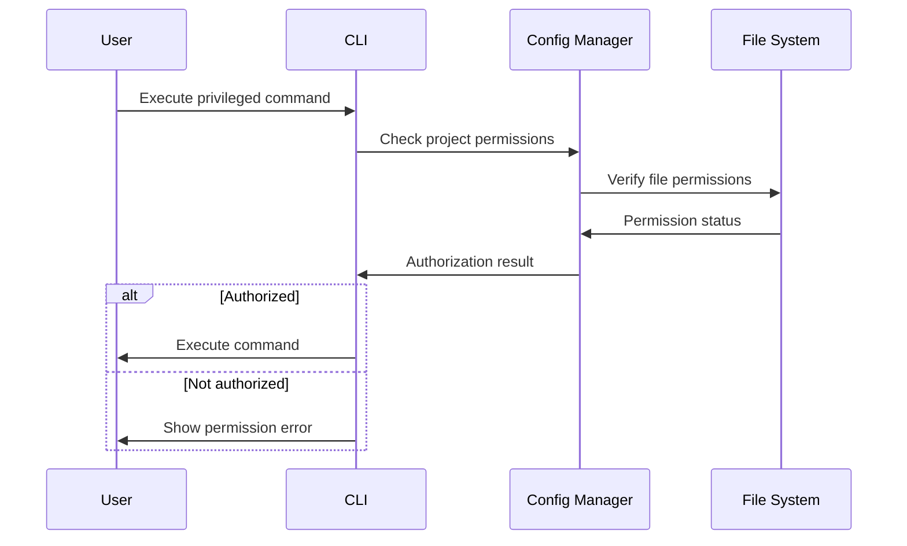

# Backend Architecture

The backend architecture is designed as a local analysis engine rather than a traditional server backend. The "backend" components run as part of the CLI tool.

## Service Architecture

### Function Organization

```
src/services/
├── analysis/          # Core analysis engine
│   ├── engine.ts      # Main analysis orchestrator
│   ├── scheduler.ts   # Task scheduling and execution
│   ├── cache.ts       # Result caching
│   └── plugins.ts     # Plugin management
├── tools/             # Analysis tool integrations
│   ├── bun-test.ts    # Bun test integration
│   ├── eslint.ts      # ESLint integration
│   ├── prettier.ts    # Prettier integration
│   └── typescript.ts  # TypeScript integration
├── config/            # Configuration management
│   ├── manager.ts     # Configuration manager
│   ├── validator.ts   # Configuration validation
│   └── migration.ts   # Migration utilities
├── storage/           # Data persistence
│   ├── database.ts    # SQLite database manager
│   ├── repository.ts  # Data repositories
│   └── migration.ts   # Database migrations
└── reporting/         # Report generation
    ├── generator.ts   # Report generation engine
    ├── templates.ts   # Report templates
    └── export.ts      # Export utilities
```

### Function Template

```typescript
// Example analysis function
import { AnalysisContext, ToolResult } from "../types";

export class BunTestAnalyzer {
  async execute(context: AnalysisContext): Promise<ToolResult> {
    const startTime = Date.now();

    try {
      // Execute bun test with coverage
      const result = await this.runBunTest(context);

      return {
        toolName: "bun-test",
        executionTime: Date.now() - startTime,
        status: "success",
        issues: result.issues,
        metrics: result.metrics,
        coverage: result.coverage
      };
    } catch (error) {
      return {
        toolName: "bun-test",
        executionTime: Date.now() - startTime,
        status: "error",
        issues: [
          {
            id: generateId(),
            type: "error",
            toolName: "bun-test",
            filePath: "",
            lineNumber: 0,
            message: error.message,
            fixable: false,
            score: 10
          }
        ],
        metrics: {}
      };
    }
  }

  private async runBunTest(context: AnalysisContext): Promise<BunTestResult> {
    // Implementation of bun test execution
    // Include coverage collection and issue detection
  }
}
```

## Database Architecture

### Schema Design

```sql
-- Database schema defined in previous section
```

### Data Access Layer

```typescript
// Repository pattern implementation
export class ProjectRepositoryImpl implements ProjectRepository {
  private db: Database;

  constructor(db: Database) {
    this.db = db;
  }

  async findById(id: string): Promise<ProjectConfiguration | null> {
    const row = await this.db.get(
      `
            SELECT p.*,
                   json_group_array(
                       json_object('tool_name', tc.tool_name,
                                  'enabled', tc.enabled,
                                  'config_path', tc.config_path,
                                  'version', tc.version,
                                  'options', tc.options,
                                  'status', tc.status)
                   ) as tools
            FROM projects p
            LEFT JOIN tool_configs tc ON p.id = tc.project_id
            WHERE p.id = ?
            GROUP BY p.id
        `,
      [id]
    );

    if (!row) return null;

    return {
      id: row.id,
      path: row.path,
      name: row.name,
      type: row.type,
      tools: JSON.parse(row.tools || "[]"),
      settings: JSON.parse(row.settings || "{}"),
      createdAt: new Date(row.created_at),
      updatedAt: new Date(row.updated_at)
    };
  }

  async save(project: ProjectConfiguration): Promise<void> {
    await this.db.run(
      `
            INSERT OR REPLACE INTO projects
            (id, path, name, type, settings, created_at, updated_at)
            VALUES (?, ?, ?, ?, ?, ?, ?)
        `,
      [
        project.id,
        project.path,
        project.name,
        project.type,
        JSON.stringify(project.settings),
        project.createdAt.toISOString(),
        new Date().toISOString()
      ]
    );

    // Save tool configurations
    for (const tool of project.tools) {
      await this.db.run(
        `
                INSERT OR REPLACE INTO tool_configs
                (project_id, tool_name, enabled, config_path, version, options, status)
                VALUES (?, ?, ?, ?, ?, ?, ?)
            `,
        [
          project.id,
          tool.toolName,
          tool.enabled,
          tool.configPath,
          tool.version,
          JSON.stringify(tool.options),
          tool.status
        ]
      );
    }
  }
}
```

## Authentication and Authorization

### Auth Flow



### Middleware/Guards

```typescript
// Authorization guard for CLI commands
export class AuthorizationGuard {
  constructor(private configManager: ConfigurationManager) {}

  async canAccessProject(projectPath: string): Promise<boolean> {
    try {
      // Check file system permissions
      await fs.access(projectPath, fs.constants.R_OK);

      // Check if project is configured
      const config = await this.configManager.findByPath(projectPath);
      return !!config;
    } catch {
      return false;
    }
  }

  async requireProjectAccess(projectPath: string): Promise<void> {
    if (!(await this.canAccessProject(projectPath))) {
      throw new Error(`Access denied to project: ${projectPath}`);
    }
  }
}
```
