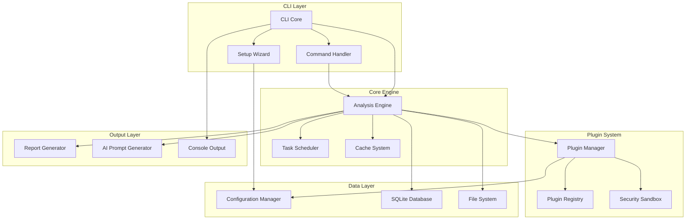

# Components

## CLI Core

**Responsibility:** Main application entry point and command orchestration

**Key Interfaces:**

- Command registration and parsing
- Configuration management
- Plugin system initialization
- Error handling and logging
- Progress reporting

**Dependencies:** Commander.js, Ink, configuration manager
**Technology Stack:** TypeScript, Commander.js, Ink

## Setup Wizard

**Responsibility:** Interactive project configuration and setup

**Key Interfaces:**

- Project type detection
- Existing tool discovery
- Configuration generation
- Validation and testing
- Rollback capabilities

**Dependencies:** File system, package managers, configuration manager
**Technology Stack:** Ink, TypeScript, file system APIs

## Analysis Engine

**Responsibility:** Core analysis orchestration and result aggregation

**Key Interfaces:**

- Task scheduling and execution
- Result aggregation and normalization
- Caching and incremental analysis
- Performance optimization
- Error recovery and graceful degradation

**Dependencies:** Plugin manager, cache system, task scheduler
**Technology Stack:** TypeScript, event emitters, worker threads

## Plugin Manager

**Responsibility:** Plugin lifecycle management and execution

**Key Interfaces:**

- Plugin discovery and loading
- Dependency resolution
- Sandbox execution
- Performance monitoring
- Version compatibility

**Dependencies:** Plugin registry, security sandbox, dependency resolver
**Technology Stack:** TypeScript, dynamic imports, worker threads

## Configuration Manager

**Responsibility:** Configuration loading, validation, and persistence

**Key Interfaces:**

- Configuration file parsing
- Schema validation
- User preference management
- Environment variable handling
- Configuration migration

**Dependencies:** File system, validation schemas, environment APIs
**Technology Stack:** TypeScript, JSON schema, file system APIs

## Report Generator

**Responsibility:** Result reporting and export in multiple formats

**Key Interfaces:**

- Template-based report generation
- Multiple format support (JSON, HTML, Markdown)
- Data visualization
- Trend analysis
- Export optimization

**Dependencies:** Template engine, chart library, file system
**Technology Stack:** TypeScript, template engines, chart libraries

## AI Prompt Generator

**Responsibility:** AI-optimized prompt generation for code improvements

**Key Interfaces:**

- Context-aware prompt generation
- Multiple AI model support
- Template management
- Effectiveness tracking
- Custom prompt templates

**Dependencies:** Template engine, AI model APIs, context analysis
**Technology Stack:** TypeScript, template engines, HTTP clients

## Cache System

**Responsibility:** Multi-layer caching for performance optimization

**Key Interfaces:**

- In-memory caching
- Persistent SQLite caching
- Cache invalidation
- Compression and optimization
- Analytics and metrics

**Dependencies:** SQLite, memory cache, compression libraries
**Technology Stack:** TypeScript, SQLite, LRU cache

## Component Diagrams

