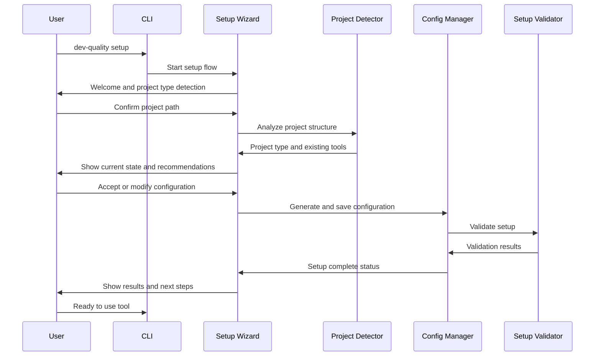
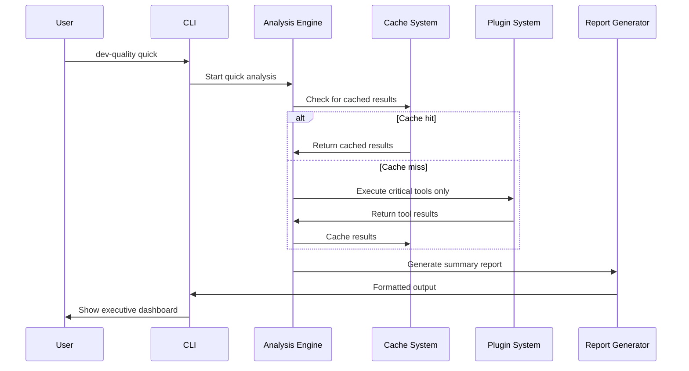
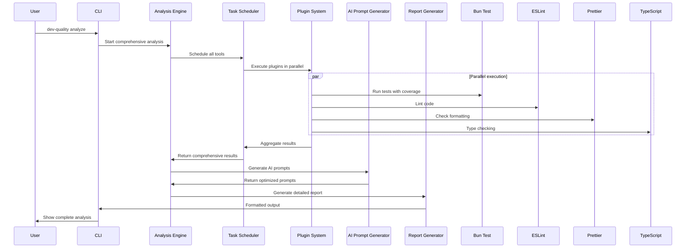
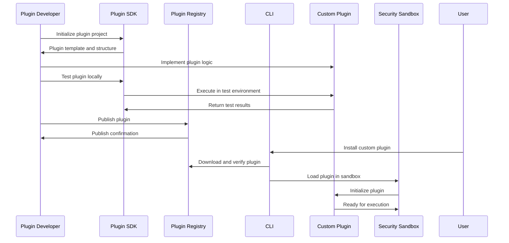

# Core Workflows

## Setup Wizard Workflow

```mermaid
sequenceDiagram
    participant User as User
    participant CLI as CLI
    participant Wizard as Setup Wizard
    participant Detector as Project Detector
    participant Config as Config Manager
    participant Validator as Setup Validator

    User->>CLI: dev-quality setup
    CLI->>Wizard: Start setup flow
    Wizard->>User: Welcome and project type detection
    User->>Wizard: Confirm project path
    Wizard->>Detector: Analyze project structure
    Detector->>Wizard: Project type and existing tools
    Wizard->>User: Show current state and recommendations
    User->>Wizard: Accept or modify configuration
    Wizard->>Config: Generate and save configuration
    Config->>Validator: Validate setup
    Validator->>Config: Validation results
    Config->>Wizard: Setup complete status
    Wizard->>User: Show results and next steps
    User->>CLI: Ready to use tool
```

## Quick Analysis Workflow

```mermaid
sequenceDiagram
    participant User as User
    participant CLI as CLI
    participant Engine as Analysis Engine
    participant Cache as Cache System
    participant Plugins as Plugin System
    participant Output as Report Generator

    User->>CLI: dev-quality quick
    CLI->>Engine: Start quick analysis
    Engine->>Cache: Check for cached results
    alt Cache hit
        Cache->>Engine: Return cached results
    else Cache miss
        Engine->>Plugins: Execute critical tools only
        Plugins->>Engine: Return tool results
        Engine->>Cache: Cache results
    end
    Engine->>Output: Generate summary report
    Output->>CLI: Formatted output
    CLI->>User: Show executive dashboard
```

## Comprehensive Analysis Workflow

```mermaid
sequenceDiagram
    participant User as User
    participant CLI as CLI
    participant Engine as Analysis Engine
    participant Scheduler as Task Scheduler
    participant Plugins as Plugin System
    participant AI as AI Prompt Generator
    participant Output as Report Generator

    User->>CLI: dev-quality analyze
    CLI->>Engine: Start comprehensive analysis
    Engine->>Scheduler: Schedule all tools
    Scheduler->>Plugins: Execute plugins in parallel
    par Parallel execution
        Plugins->>Bun Test: Run tests with coverage
        Plugins->>ESLint: Lint code
        Plugins->>Prettier: Check formatting
        Plugins->>TypeScript: Type checking
    end
    Plugins->>Scheduler: Aggregate results
    Scheduler->>Engine: Return comprehensive results
    Engine->>AI: Generate AI prompts
    AI->>Engine: Return optimized prompts
    Engine->>Output: Generate detailed report
    Output->>CLI: Formatted output
    CLI->>User: Show complete analysis
```

## Plugin Development Workflow

```mermaid
sequenceDiagram
    participant Dev as Plugin Developer
    participant SDK as Plugin SDK
    participant Registry as Plugin Registry
    participant CLI as CLI
    participant Plugin as Custom Plugin
    participant Sandbox as Security Sandbox

    Dev->>SDK: Initialize plugin project
    SDK->>Dev: Plugin template and structure
    Dev->>Plugin: Implement plugin logic
    Dev->>SDK: Test plugin locally
    SDK->>Plugin: Execute in test environment
    Plugin->>SDK: Return test results
    Dev->>Registry: Publish plugin
    Registry->>Dev: Publish confirmation
    User->>CLI: Install custom plugin
    CLI->>Registry: Download and verify plugin
    CLI->>Sandbox: Load plugin in sandbox
    Sandbox->>Plugin: Initialize plugin
    Plugin->>Sandbox: Ready for execution
```
