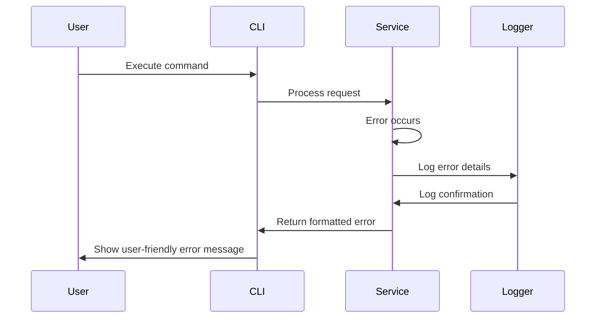

# Error Handling Strategy

## Error Flow



## Error Response Format

```typescript
interface ApiError {
  error: {
    code: string;
    message: string;
    details?: Record<string, any>;
    timestamp: string;
    requestId: string;
  };
}
```

## Frontend Error Handling

```typescript
// CLI error handler component
import React from "react";
import { Box, Text } from "ink";

interface ErrorDisplayProps {
  error: Error;
  context?: string;
}

const ErrorDisplay: React.FC<ErrorDisplayProps> = ({ error, context }) => {
  return (
    <Box flexDirection="column" gap={1}>
      <Text color="red">✗ Error</Text>
      {context && <Text dimColor>Context: {context}</Text>}
      <Text>{error.message}</Text>
      {process.env.NODE_ENV === "development" && (
        <Text dimColor>{error.stack}</Text>
      )}
    </Box>
  );
};

export default ErrorDisplay;
```

## Backend Error Handling

```typescript
// Centralized error handler
class ErrorHandler {
  constructor(private logger: Logger) {}

  handle(error: Error, context: string): ApiError {
    const errorId = generateErrorId();

    this.logger.error("Analysis error", {
      errorId,
      context,
      message: error.message,
      stack: error.stack,
      timestamp: new Date().toISOString()
    });

    return {
      error: {
        code: this.getErrorCode(error),
        message: this.getUserMessage(error),
        details:
          process.env.NODE_ENV === "development"
            ? {
                stack: error.stack,
                context
              }
            : undefined,
        timestamp: new Date().toISOString(),
        requestId: errorId
      }
    };
  }

  private getErrorCode(error: Error): string {
    if (error instanceof ConfigurationError) return "CONFIG_ERROR";
    if (error instanceof PluginError) return "PLUGIN_ERROR";
    if (error instanceof FileNotFoundError) return "FILE_NOT_FOUND";
    return "INTERNAL_ERROR";
  }

  private getUserMessage(error: Error): string {
    if (error instanceof ConfigurationError) {
      return 'Configuration error. Please run "dev-quality setup" to reconfigure.';
    }
    if (error instanceof FileNotFoundError) {
      return "Project file not found. Please check the project path.";
    }
    return "An unexpected error occurred. Please try again.";
  }
}
```
