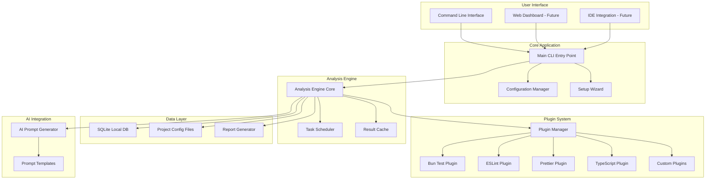

# High Level Architecture

## Technical Summary

DevQuality CLI is a modern command-line tool built with TypeScript and Bun, featuring an event-driven plugin architecture for extensible quality analysis. The tool integrates multiple quality checking systems (Bun test, ESLint, Prettier, TypeScript) into a unified analysis engine with both immediate CLI feedback and extensible web-based reporting capabilities. The architecture supports rapid setup through intelligent project detection and provides comprehensive insights through AI-optimized prompt generation.

## Platform and Infrastructure Choice

**Platform:** Local-first CLI with optional cloud components for enhanced features
**Key Services:** Local analysis engine with optional cloud-based reporting and collaboration features
**Deployment Host and Regions:** N/A (CLI tool distributed via npm registry)

**Platform Decision Rationale:**

- **Local-first**: CLI tool prioritizes developer privacy and offline capability
- **NPM Distribution**: Leverages existing package manager ecosystem
- **Optional Cloud**: Web components are additive, not required for core functionality
- **Cross-platform**: Native performance on macOS, Linux, and Windows

## Repository Structure

**Structure:** Monorepo with clear package boundaries
**Monorepo Tool:** npm workspaces (simple, native, no additional tooling overhead)
**Package Organization:** Core CLI, analysis engine, plugins, and potential web interface as separate packages

**Repository Strategy Rationale:**

- **Monorepo**: Enables tight integration between CLI and analysis components
- **npm workspaces**: Simplifies dependency management and cross-package development
- **Clear boundaries**: Core CLI logic separate from extensible analysis plugins
- **Future-ready**: Accommodates web interface expansion without architectural changes

## High Level Architecture Diagram

## Architectural Patterns

- **Event-Driven Architecture**: Plugin system uses event bus for loose coupling between analysis tools
- **Repository Pattern**: Abstracts data access for configuration and results storage
- **Strategy Pattern**: Different analysis tools implement common interfaces for consistent execution
- **Command Pattern**: CLI commands encapsulate analysis operations with undo/redo capability
- **Observer Pattern**: Real-time progress updates and result streaming
- **Template Method**: Standardized analysis workflow with tool-specific implementations
- **Dependency Injection**: Modular component architecture with clear interface contracts
