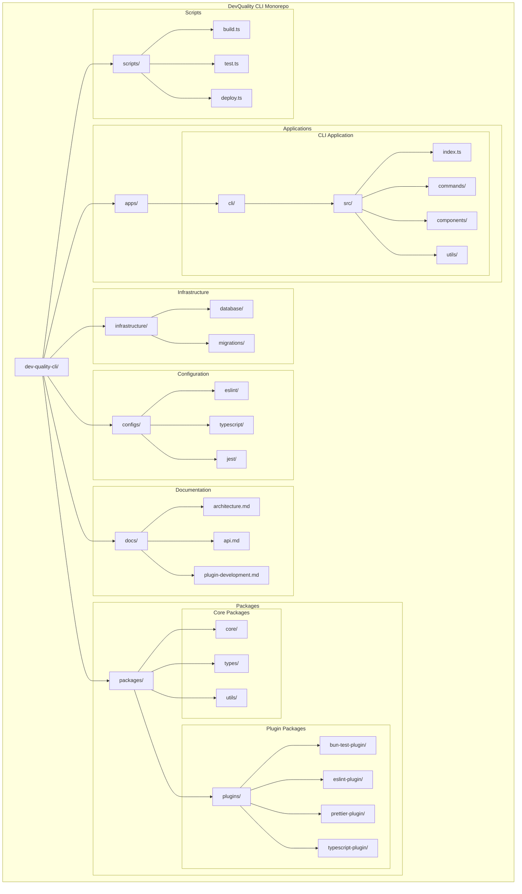

# Unified Project Structure

```mermaid
graph TD
    subgraph "DevQuality CLI Monorepo"
        A[dev-quality-cli/]
        subgraph "Applications"
            B[apps/]
            subgraph "CLI Application"
                C[cli/]
                D[src/]
                E[index.ts]
                F[commands/]
                G[components/]
                H[utils/]
            end
        end

        subgraph "Packages"
            I[packages/]
            subgraph "Core Packages"
                J[core/]
                K[types/]
                L[utils/]
            end
            subgraph "Plugin Packages"
                M[plugins/]
                N[bun-test-plugin/]
                O[eslint-plugin/]
                P[prettier-plugin/]
                Q[typescript-plugin/]
            end
        end

        subgraph "Infrastructure"
            R[infrastructure/]
            S[database/]
            T[migrations/]
        end

        subgraph "Configuration"
            U[configs/]
            V[eslint/]
            W[typescript/]
            X[jest/]
        end

        subgraph "Documentation"
            Y[docs/]
            Z[architecture.md]
            AA[api.md]
            AB[plugin-development.md]
        end

        subgraph "Scripts"
            AC[scripts/]
            AD[build.ts]
            AE[test.ts]
            AF[deploy.ts]
        end
    end

    A --> B
    A --> I
    A --> R
    A --> U
    A --> Y
    A --> AC

    B --> C
    C --> D
    D --> E
    D --> F
    D --> G
    D --> H

    I --> J
    I --> K
    I --> L
    I --> M
    M --> N
    M --> O
    M --> P
    M --> Q

    R --> S
    R --> T

    U --> V
    U --> W
    U --> X

    Y --> Z
    Y --> AA
    Y --> AB

    AC --> AD
    AC --> AE
    AC --> AF
```

For detailed file structure, see [Source Tree](./source-tree.md).
