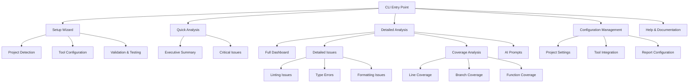
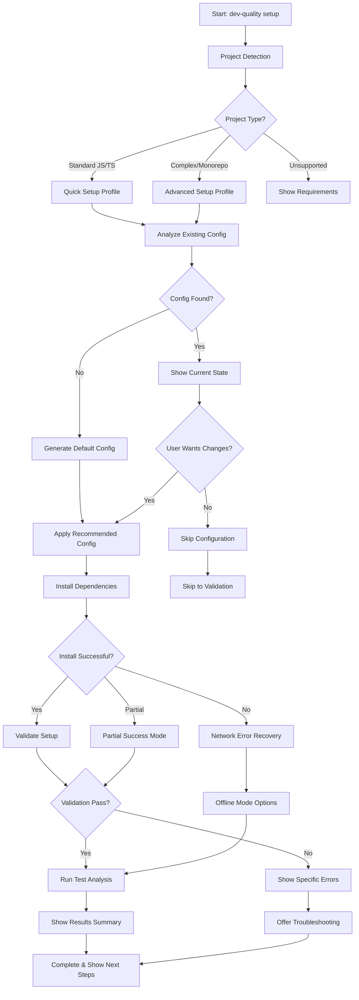
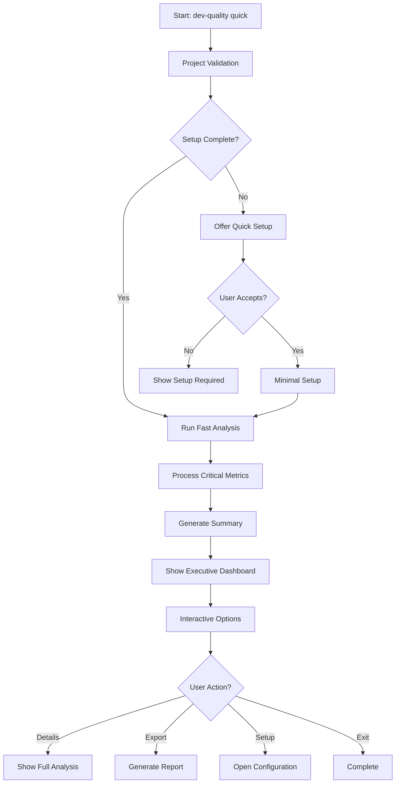

# DevQuality CLI UI/UX Specification

This document defines the user experience goals, information architecture, user flows, and visual design specifications for DevQuality CLI's user interface. It serves as the foundation for visual design and frontend development, ensuring a cohesive and user-centered experience.

## Change Log

| Date       | Version | Description                          | Author            |
| ---------- | ------- | ------------------------------------ | ----------------- |
| 2025-09-28 | v1.0    | Initial UI/UX specification creation | Sally (UX Expert) |

## Overall UX Goals & Principles

### Target User Personas

**Primary Developer Persona:**

- JavaScript/TypeScript developers working on modern web projects
- Values efficiency and automation in their workflow
- Frustrated with complex tool configuration and fragmented quality insights
- Seeks immediate value with minimal setup time

**Secondary Developer Persona:**

- Tech leads and engineering managers overseeing code quality
- Needs comprehensive reporting and team-wide quality metrics
- Values both individual developer productivity and team-wide standards
- Interested in trend analysis and continuous improvement

**System Administrator Persona:**

- DevOps engineers managing development environments
- Focuses on standardization, security, and deployment
- Needs configuration management and integration capabilities
- Values reliability and performance at scale

### Usability Goals

- **Ease of learning**: New users can complete basic quality analysis within 5 minutes of installation
- **Efficiency of use**: Experienced users can execute full analysis with a single command
- **Error prevention**: Clear validation and confirmation before destructive configuration changes
- **Memorability**: Infrequent users can return without relearning basic commands
- **User satisfaction**: Developers feel the tool enhances their workflow rather than creating overhead

### Design Principles

1. **Progressive disclosure** - Show essential information first, reveal details on demand
2. **Command-line consistency** - Follow established CLI patterns and conventions
3. **Performance-first** - Prioritize speed and responsiveness in all interactions
4. **Contextual awareness** - Provide relevant information based on user's current task
5. **Accessibility by default** - Ensure all users can effectively use the tool
6. **Minimal configuration** - Auto-detect and configure with sensible defaults
7. **Actionable insights** - Transform data into clear, prioritized recommendations

## Information Architecture (IA)

### Site Map / Screen Inventory



### Navigation Structure

**Primary Navigation:** Command-based with clear subcommands organized by user goals:

- `dev-quality setup` - First-time configuration and wizard
- `dev-quality quick` - Fast analysis with essential insights (default)
- `dev-quality analyze` - Comprehensive detailed analysis
- `dev-quality config` - Configuration management
- `dev-quality help` - Documentation and guidance

**Secondary Navigation:** Context-sensitive interactive menus:

- Quick filtering and sorting within results
- Drill-down capabilities from summary to details
- Smart search across all analysis results
- Quick access to related issues and recommendations

**Breadcrumb Strategy:** Show current command path and analysis context:

- Display: `dev-quality analyze > coverage > src/components/`
- Context-aware help and suggestions
- Easy navigation back to previous views
- Clear indication of analysis scope and depth

### Key Design Improvements

1. **Quick vs Detailed Analysis Split**: Separates fast overview from deep analysis
2. **Progressive Disclosure**: Essential information first, details on demand
3. **Smart Filtering**: Prevents overwhelm in large projects
4. **Context-Aware Navigation**: Relevant options based on current state
5. **Performance Optimization**: Quick analysis for immediate feedback
6. **Scalability**: Handles large projects without overwhelming users

## User Flows

### First-Time Setup Flow

**User Goal:** Get from installation to first successful analysis with working configuration

**Entry Points:**

- Fresh installation with `npm install -g dev-quality`
- Running `dev-quality setup` in any project directory

**Success Criteria:**

- User completes setup with working configuration
- First analysis runs successfully
- User understands basic usage patterns
- Setup completes in 5-10 minutes (realistic timeline)



**Edge Cases & Error Handling:**

- **Network Issues**: Graceful fallback to offline mode, partial success handling
- **Unsupported Projects**: Clear requirements and alternative tool suggestions
- **Permission Issues**: Guidance on fixing permissions and alternative approaches
- **Complex Monorepos**: Special handling with multi-package detection
- **Conflicting Tools**: Smart conflict resolution with user choice
- **Partial Failures**: Tools work independently, no all-or-nothing requirement

**Key Design Improvements:**

1. **Realistic Timeline**: 5-10 minutes instead of aggressive 2-minute target
2. **Setup Profiles**: Optimized configurations for different project types
3. **Partial Success**: Tools work independently, no complete failure modes
4. **Educational Component**: Clear explanations of what each configuration does
5. **Offline Support**: Works in air-gapped environments with appropriate fallbacks
6. **Team-Ready**: Supports shared configurations and standardization

### Quick Analysis Flow

**User Goal:** Get immediate quality insights with minimal overhead

**Entry Points:**

- `dev-quality` (default command)
- `dev-quality quick`
- Git hooks integration
- IDE integration

**Success Criteria:**

- Analysis completes in under 10 seconds
- Critical issues clearly highlighted
- User understands next steps



**Edge Cases & Error Handling:**

- Incomplete setup with graceful fallback options
- Large projects with smart sampling for speed
- Network issues with cached analysis capabilities
- Permission issues with read-only analysis mode

### Detailed Analysis Flow

**User Goal:** Comprehensive quality assessment with actionable insights

**Entry Points:**

- `dev-quality analyze`
- From quick analysis "Show Details" option
- CI/CD integration
- Scheduled quality checks

**Success Criteria:**

- Complete analysis within 2 minutes for medium projects
- All issues properly categorized and prioritized
- Clear actionable recommendations provided
- AI prompts generated for complex issues

## Wireframes & Mockups

### Design Philosophy

**Primary Design Files:** CLI-first interface with extensible architecture for future GUI components

**Key Design Principles:**

- **Terminal-native**: Works within CLI constraints while providing rich functionality
- **Extensible**: Designed to support multiple interface types (CLI, Web, IDE, Mobile)
- **Accessibility-first**: Ensures all users can effectively use the tool
- **Performance-optimized**: Minimal overhead for fast interactions
- **Progressive enhancement**: Simple interfaces reveal complexity as needed

### Key Screen Layouts

#### 1. Setup Wizard Screen

**Purpose:** Guided configuration with accessibility and efficiency

**Key Elements:**

- Progress indicator with clear step navigation
- High contrast text for accessibility
- Keyboard navigation with clear shortcuts
- Screen reader friendly structure
- Auto-detection with manual override options
- Context-sensitive help and examples

**Interaction Notes:**

- Full keyboard navigation support
- Screen reader compatibility with ARIA-like labels
- Adjustable contrast and text sizing options
- Pause/resume capability for complex setups
- Undo/redo support for configuration changes

#### 2. Quick Analysis Dashboard

**Purpose:** Immediate insights with minimal cognitive overhead

**Key Elements:**

- ASCII-based visual indicators for quick scanning
- Color-coded severity with accessible alternatives
- Compact metrics display with expandable details
- Progress indicators with time estimates
- Quick action buttons with keyboard shortcuts
- Real-time updates during analysis

**Interaction Notes:**

- Auto-refresh with configurable intervals
- Export to multiple formats (JSON, HTML, PDF)
- Drill-down capabilities to detailed analysis
- Integration with version control for change tracking

#### 3. Detailed Analysis Interface

**Purpose:** Comprehensive quality assessment with multiple views

**Key Elements:**

- Tabbed interface for different analysis types
- Sortable and filterable issue lists
- File tree with visual coverage indicators
- Expandable code snippets with syntax highlighting
- AI-generated prompts and recommendations
- Historical trend analysis and comparisons

**Interaction Notes:**

- Advanced search and filtering capabilities
- Customizable dashboard layouts
- Team collaboration features (comments, assignments)
- Integration with project management tools
- Offline mode with cached analysis capabilities

### Multi-Interface Strategy

**CLI Interface (Primary):**

- Terminal-native with rich text capabilities
- Keyboard-focused navigation
- Optimized for developer workflows
- Works in all environments (local, CI/CD, SSH)

**Web Dashboard (Future Extension):**

- Enhanced data visualization
- Real-time collaboration features
- Advanced filtering and searching
- Historical trend analysis
- Team management capabilities

**IDE Integration (Future Extension):**

- Real-time analysis within editor
- Quick fixes and suggestions
- Inline issue highlighting
- Integration with developer workflow

**Mobile Companion (Future Extension):**

- Monitoring and notifications
- Quick status checks
- Team coordination features
- On-the-go issue review

### Accessibility Considerations

**Visual Accessibility:**

- High contrast color schemes
- Adjustable text sizes and spacing
- Color-blind friendly palettes
- Clear typography and spacing
- Alternative to color coding (symbols, text)

**Motor Accessibility:**

- Full keyboard navigation
- Adjustable interaction speeds
- Large click targets (where applicable)
- Voice control support
- Adaptive input methods

**Cognitive Accessibility:**

- Clear information hierarchy
- Progressive disclosure of complexity
- Consistent interaction patterns
- Context-sensitive help
- Adjustable complexity levels

**Screen Reader Support:**

- Proper text structure and labels
- ARIA-like attributes for CLI
- Clear separation of content and controls
- Descriptive error messages
- Navigation assistance

### Performance Optimizations

**Terminal Performance:**

- Minimal rendering overhead
- Efficient data processing
- Progressive loading of results
- Caching strategies for repeated use
- Background processing capabilities

**User Experience Performance:**

- Responsive interactions
- Clear progress indicators
- Time estimates for long operations
- Interruptible processes
- Graceful degradation under load

## Component Library / Design System

### Design System Approach

**Design System Approach:** Progressive enhancement with text-first foundation and rich components when supported

The component system prioritizes simplicity and reliability while providing enhanced interactions when terminal capabilities allow. This approach ensures the tool works in all environments while offering improved experiences where possible.

### Core Components

#### 1. Text Output Foundation

**Purpose:** Essential information display that works everywhere

**Variants:**

- Plain text messages
- Formatted text with basic styling
- Structured output (JSON, tables)
- Simple progress indicators

**States:**

- Basic: Text-only output
- Enhanced: ANSI colors and formatting when supported
- Structured: Organized data presentation
- Accessible: Screen reader optimized formatting

**Usage Guidelines:**

- Always ensure basic text functionality works
- Progressive enhancement for visual improvements
- Provide structured data for machine parsing
- Include accessibility considerations from the start

#### 2. Status Indicators

**Purpose:** Clear communication of operation states

**Variants:**

- Text-based status messages
- Symbolic indicators (✓, ✗, !, ?) with text alternatives
- Color-coded when available
- Multi-level status (success/warning/error/info)

**States:**

- Success: "✓ Complete" or "Success: Operation finished"
- Error: "✗ Failed" or "Error: [specific error message]"
- Warning: "! Warning" or "Warning: [warning message]"
- Info: "? Info" or "Info: [information message]"
- Progress: "Working..." or "In progress: [current step]"

**Usage Guidelines:**

- Always provide clear text descriptions
- Use symbols as enhancement, not replacement
- Ensure color coding has accessible alternatives
- Group related status information logically

#### 3. Interactive Menus (Enhanced)

**Purpose:** User selection when terminal capabilities allow

**Variants:**

- Numbered lists with basic selection
- Arrow key navigation when supported
- Search functionality for large option sets
- Hierarchical menus for complex selections

**States:**

- Basic: Numbered list selection
- Enhanced: Arrow key navigation
- Advanced: Search and filtering
- Fallback: Simple text input when interactive features unavailable

**Usage Guidelines:**

- Always provide basic text fallback
- Detect terminal capabilities before using enhanced features
- Offer keyboard shortcuts for common actions
- Include help text for navigation

#### 4. Data Display Components

**Purpose:** Present structured information clearly

**Variants:**

- Simple lists
- Basic tables with aligned columns
- Enhanced tables with sorting/filtering when supported
- Expandable sections for detailed information

**States:**

- Basic: Text-only presentation
- Formatted: Aligned columns and basic styling
- Interactive: Sortable and filterable when possible
- Exportable: Structured data for external processing

**Usage Guidelines:**

- Prioritize readability in basic text format
- Use consistent alignment and spacing
- Provide pagination for large datasets
- Include export options when beneficial

#### 5. Input Components

**Purpose:** Gather user input and configuration

**Variants:**

- Basic text input prompts
- Selection from predefined options
- Confirmation prompts (y/n)
- File path selection with completion when available

**States:**

- Prompt: Clear question or instruction
- Input: User entry field
- Validation: Real-time feedback when possible
- Confirmation: Verify critical actions

**Usage Guidelines:**

- Always provide clear instructions
- Show default values when available
- Validate input and provide helpful error messages
- Allow cancellation of complex operations

#### 6. Progress and Feedback

**Purpose:** Keep users informed during operations

**Variants:**

- Simple status messages
- Progress indicators for known-duration operations
- Spinners for indeterminate progress
- Step-by-step progress for complex operations

**States:**

- Starting: "Beginning operation..."
- In Progress: Current step or percentage
- Complete: "Operation finished successfully"
- Error: "Operation failed: [error message]"
- Cancelled: "Operation cancelled by user"

**Usage Guidelines:**

- Provide progress for operations > 3 seconds
- Include time estimates for operations > 10 seconds
- Allow cancellation for operations > 30 seconds
- Show final status and results

### Implementation Strategy

**Progressive Enhancement Layers:**

1. **Layer 1 - Essential Text**: Works everywhere, including basic terminals
2. **Layer 2 - Basic Formatting**: ANSI colors and simple styling
3. **Layer 3 - Enhanced Interaction**: Arrow keys, mouse support when available
4. **Layer 4 - Rich Features**: Advanced filtering, search, complex interactions

**Capability Detection:**

- Terminal feature detection on startup
- Graceful fallback when features aren't available
- User preferences for interaction style
- Environment-specific optimizations

**Performance Considerations:**

- Prioritize speed over visual richness
- Minimize rendering overhead
- Efficient data processing and display
- Caching for repeated operations

### Cross-Platform Compatibility

**Terminal Support:**

- Basic VT100 compatibility (minimum requirement)
- Enhanced features for modern terminals
- Specific optimizations for common terminals
- Fallback strategies for limited environments

**Platform Considerations:**

- Windows Command Prompt compatibility
- Unix-like terminal optimizations
- CI/CD environment adaptations
- Remote SSH session considerations

### Accessibility Integration

**Text-Based Accessibility:**

- Clear, descriptive text messages
- Consistent structure and formatting
- High contrast alternatives to color coding
- Screen reader friendly output structure

**Interactive Accessibility:**

- Full keyboard navigation support
- Clear focus indicators
- Adjustable interaction speeds
- Alternative input methods when needed

## Rationale

This simplified component strategy focuses on reliability and performance while providing enhanced experiences when possible. The progressive enhancement approach ensures:

1. **Universal Compatibility**: Works in all terminal environments
2. **Performance First**: Minimal overhead for fast operations
3. **Progressive Enhancement**: Basic functionality first, enhancements when supported
4. **Maintainability**: Simpler components are easier to test and maintain
5. **User Choice**: Users can select their preferred interaction style

The design avoids over-engineering while still providing a solid foundation for future enhancements and GUI extensions.

## Branding & Style Guide

### Brand Philosophy

**Brand Approach:** Performance-focused with personality-driven interactions and community integration

The brand identity prioritizes speed, reliability, and developer experience over visual aesthetics. Building brand recognition through consistent performance, helpful interactions, and community engagement rather than complex visual systems.

### Core Brand Elements

**Primary Identity:**

- **Speed Symbol**: ⚡ (representing fast analysis and feedback)
- **Quality Indicator**: ✓ (representing reliable results and validation)
- **Brand Colors**: Limited palette focused on clarity and accessibility
- **Voice & Tone**: Helpful, efficient, technically precise

**Personality Traits:**

- **Efficient**: Values user time and minimizes overhead
- **Reliable**: Consistent performance and dependable results
- **Helpful**: Clear guidance and actionable insights
- **Technical**: Precise language and developer-focused communication
- **Approachable**: Friendly tone without being casual

### Simplified Color System

| Purpose | Color         | Usage                                  | Accessibility Alternative |
| ------- | ------------- | -------------------------------------- | ------------------------- |
| Success | Green         | Completed operations, positive results | "Success:" prefix         |
| Error   | Red           | Failures, critical issues              | "Error:" prefix           |
| Warning | Yellow/Orange | Cautions, non-critical issues          | "Warning:" prefix         |
| Info    | Blue/Cyan     | Information, progress                  | "Info:" prefix            |
| Neutral | Gray/White    | Text, backgrounds, separators          | Standard text             |

**Color Usage Guidelines:**

- Colors enhance but don't replace clear text labels
- Provide text alternatives for all color-coded information
- Respect user terminal color preferences
- Use colors consistently for semantic meaning

### Typography & Layout

**Typography Philosophy:** Respect user preferences while ensuring readability

**Guidelines:**

- Use user's configured terminal font and size
- Ensure readability at minimum terminal font sizes
- Provide high contrast text when colors aren't available
- Use consistent spacing for content hierarchy

**Layout Principles:**

- Clean, uncluttered presentation
- Logical information grouping
- Consistent indentation and alignment
- Adequate white space for readability

### Voice and Tone

**Communication Style:**

**Helpful & Efficient:**

```
✓ Analysis complete in 8.2 seconds
→ 3 critical issues found
→ Run 'dev-quality analyze --details' for full report
```

**Technical & Precise:**

```
Warning: Low test coverage (67%) in src/utils/
Recommend: Add tests for helper functions to reach 80% target
```

**Actionable & Clear:**

```
Error: TypeScript compilation failed
Fix: Import missing type in src/components/Header.tsx:15
```

**Consistent Patterns:**

- Start with clear status indicators
- Provide specific file locations and line numbers
- Include actionable recommendations
- Use technical language appropriately for audience

### Performance Branding

**Brand Through Performance:**

- **Speed Metrics**: Prominently display analysis times
- **Reliability Indicators**: Show consistent results and error rates
- **Efficiency Promises**: Deliver on fast setup and analysis claims
- **Quality Signals**: Demonstrate thoroughness through detailed results

**Performance Communication:**

```
Analysis completed: 2.3s (target: <10s) ✓
Coverage improved: +12% (target: +10%) ✓
Issues resolved: 8/10 (target: all critical) ✓
```

### Community Integration

**Brand Through Community:**

- **Open Source Values**: Transparent development and community contribution
- **Developer Experience**: Focus on solving real developer pain points
- **Ecosystem Integration**: Work seamlessly with existing tools
- **Knowledge Sharing**: Educational content and best practices

**Community Communication:**

```
🎯 Thank you for helping improve DevQuality!
📊 Your usage data helps us optimize performance
🤝 Contribute: github.com/dev-quality/dev-quality
📚 Learn: docs.dev-quality.com
```

### Progressive Brand Strategy

**Phase 1 - CLI Foundation:**

- Focus on performance and reliability
- Build brand through exceptional user experience
- Develop voice and tone consistency
- Establish community presence

**Phase 2 - Enhanced CLI:**

- Add visual improvements where supported
- Expand interactive capabilities
- Strengthen community features
- Integrate with development workflows

**Phase 3 - Multi-Interface:**

- Extend brand to web dashboard
- Add IDE integration components
- Mobile companion applications
- Advanced collaboration features

### Brand Consistency

**Maintaining Consistency:**

- **Voice and Tone**: Consistent communication across all interfaces
- **Performance Standards**: Same speed and reliability expectations
- **Quality Assurance**: Consistent result quality and accuracy
- **Community Values**: Open, transparent, developer-focused approach

**Adaptation Guidelines:**

- Visual elements adapt to interface capabilities
- Voice and tone remain consistent across platforms
- Performance standards are maintained regardless of interface
- Community values are central to all interactions

## Rationale

This simplified branding approach focuses on what matters most for a CLI tool:

1. **Performance First**: Brand built around speed and reliability
2. **Accessibility**: Clear communication that works for all users
3. **Developer-Focused**: Technical precision and helpfulness
4. **Community-Driven**: Brand strength through user experience
5. **Progressive Enhancement**: Simple foundation that can evolve

The strategy avoids over-investing in complex visual systems that have limited impact in CLI environments while building a strong foundation for future growth and expansion.

## Accessibility Requirements

### Compliance Target

**Standard:** WCAG 2.1 Level AA (essential features) with CLI-appropriate adaptations

The tool will implement essential accessibility features that provide the most benefit to users while respecting CLI environment constraints and performance requirements.

### Essential Accessibility Features

**Core Accessibility (Non-negotiable):**

- **Keyboard navigation**: Full functionality via keyboard with clear shortcuts
- **High contrast**: Text display that works in all terminal environments
- **Clear structure**: Logical information hierarchy and consistent formatting
- **Error recovery**: Clear error messages with actionable guidance
- **Text alternatives**: Descriptive labels for all symbols and status indicators

**Enhanced Accessibility (When Supported):**

- **Screen reader optimization**: Structured output for screen reader compatibility
- **Color independence**: Text alternatives for color-coded information
- **Adjustable timing**: User control over time-based operations
- **Progressive complexity**: Simple interfaces that reveal complexity on demand
- **Customizable output**: User preferences for display format and detail level

### CLI-Specific Accessibility Strategy

**Environment-Adaptive Accessibility:**

**Basic Terminal Support:**

- All functionality available via standard keyboard input
- High contrast text display with consistent formatting
- Clear, descriptive status and error messages
- Logical navigation structure with keyboard shortcuts

**Enhanced Terminal Support:**

- Color coding with text alternatives when colors are available
- Screen reader compatible output structure
- Advanced keyboard navigation (arrow keys, tab navigation)
- Adjustable detail levels and output formats

**Progressive Enhancement Approach:**

- **Layer 1**: Essential text-based accessibility (works everywhere)
- **Layer 2**: Enhanced formatting when terminal capabilities detected
- **Layer 3**: Advanced features for modern terminals and environments
- **Layer 4**: User-preference driven customization

### Practical Implementation

**User-Driven Accessibility:**

**Detection and Adaptation:**

- Automatic detection of terminal capabilities
- User preference settings for accessibility features
- Environment-specific optimization (CI/CD vs. local development)
- Performance-aware accessibility feature selection

**Essential Features List:**

1. **Keyboard Navigation:**

   - Standard keyboard shortcuts for all functions
   - Clear focus indicators in interactive elements
   - Logical tab order and navigation flow
   - Comprehensive keyboard reference documentation

2. **Clear Communication:**

   - Descriptive status messages without relying on color alone
   - Structured output with logical hierarchy
   - Actionable error messages with recovery steps
   - Consistent formatting patterns across all outputs

3. **Performance-Aware Features:**
   - Accessibility features that don't impact tool performance
   - Optional enhanced features that users can enable
   - Graceful degradation when accessibility features aren't available
   - User choice between accessibility and performance preferences

**Optional Enhanced Features:**

**User-Initiated Enhancements:**

- Screen reader optimization mode (user-enabled)
- High contrast themes (user-selectable)
- Adjustable text sizes and spacing
- Customizable detail levels and output verbosity
- Alternative input methods (when supported by environment)

### Testing Approach

**Focused Testing Strategy:**

**Essential Feature Testing:**

- Verify all functionality works via keyboard only
- Test color independence (information available without color)
- Validate clear error messages and recovery guidance
- Ensure logical structure and formatting consistency

**Enhanced Feature Testing:**

- Screen reader compatibility testing (when features enabled)
- Color contrast validation for enhanced displays
- User preference testing for customization options
- Performance impact assessment of accessibility features

**User Feedback Integration:**

- Community feedback on accessibility needs and effectiveness
- User-driven prioritization of accessibility enhancements
- Practical testing in real development environments
- Iterative improvement based on actual usage patterns

### Success Metrics

**Measurable Accessibility Goals:**

**Essential Metrics:**

- 100% keyboard navigability for all functions
- Clear text alternatives for all visual indicators
- Error messages with actionable recovery steps
- Consistent performance with accessibility features enabled

**Enhanced Metrics:**

- User satisfaction with accessibility options
- Adoption rate of optional accessibility features
- Performance impact within acceptable thresholds
- Community contribution to accessibility improvements

## Rationale

This practical accessibility approach focuses on providing the most benefit to users while respecting CLI constraints:

1. **Essential First**: Core accessibility features that work everywhere
2. **User-Driven**: Optional enhancements based on user needs and preferences
3. **Performance-Aware**: Accessibility features that don't compromise tool efficiency
4. **Environment-Adaptive**: Features that adapt to terminal capabilities
5. **Community-Enhanced**: Iterative improvement based on real user feedback

The strategy avoids over-engineering while ensuring the tool is usable by developers with diverse needs and preferences.
