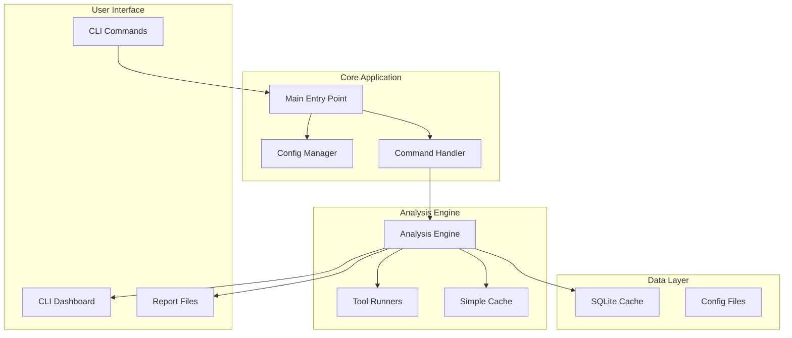

# MVP Architecture - DevQuality CLI

## Overview

This document outlines the simplified architecture for the MVP version of DevQuality CLI. The MVP focuses on **core functionality** with **hardcoded integrations** and **minimal complexity** to ensure rapid development and high quality.

### MVP Architecture Principles

1. **Simplicity Over Extensibility** - Hardcoded integrations, no plugin system
2. **Sequential Processing** - No parallel execution for simplicity
3. **Local-First** - No external dependencies or cloud services
4. **Configuration Driven** - Static configuration files, no dynamic loading
5. **Performance Focused** - Optimized for speed and low resource usage

---

## Simplified Technology Stack

### Core Technologies

| Category             | Technology   | Version | Purpose                   |
| -------------------- | ------------ | ------- | ------------------------- |
| **Language**         | TypeScript   | 5.3.3   | Type safety and tooling   |
| **Runtime**          | Bun          | 1.0.0   | Execution and testing     |
| **CLI Framework**    | Commander.js | 11.0.0  | Command parsing           |
| **Interactive UI**   | Ink          | 4.0.0   | Terminal components       |
| **State Management** | Local State  | -       | Simple state management   |
| **Database**         | SQLite       | 5.1.0   | Local caching only        |
| **File Storage**     | Local FS     | -       | Configuration and reports |

### Development Tools

| Category       | Technology | Purpose                    |
| -------------- | ---------- | -------------------------- |
| **Testing**    | Bun Test   | Unit and integration tests |
| **Linting**    | ESLint     | Code quality               |
| **Formatting** | Prettier   | Code formatting            |
| **Build**      | Bun        | Bundling and distribution  |

---

## Simplified Architecture Diagram



---

## Core Components (MVP)

### 1. CLI Core

**Responsibility**: Main application entry point and command handling

**Structure:**

```
src/
├── index.ts                 # Main entry point
├── cli/
│   ├── commands.ts          # Command definitions
│   └── options.ts           # Command options
└── types/
    └── index.ts             # Type definitions
```

**Key Features:**

- Command registration with Commander.js
- Basic argument parsing
- Help system and version info
- Simple error handling

---

### 2. Configuration Manager

**Responsibility**: Configuration loading and validation

**Structure:**

```
src/config/
├── manager.ts              # Configuration manager
├── validator.ts            # Configuration validation
├── types.ts                # Configuration types
└── defaults.ts             # Default configurations
```

**Key Features:**

- JSON configuration file support
- Environment variable overrides
- Project type detection
- Validation with clear error messages

**Configuration Schema:**

```typescript
interface MVPConfig {
  project: {
    type: "javascript" | "typescript" | "react" | "node";
    path: string;
  };
  tools: {
    eslint: {
      enabled: boolean;
      configPath?: string;
      rules?: Record<string, any>;
    };
    prettier: {
      enabled: boolean;
      configPath?: string;
      rules?: Record<string, any>;
    };
    bunTest: {
      enabled: boolean;
      configPath?: string;
      coverage?: {
        enabled: boolean;
        threshold: number;
      };
    };
  };
  analysis: {
    includePatterns: string[];
    excludePatterns: string[];
    cacheEnabled: boolean;
  };
  reporting: {
    format: "json" | "markdown" | "html";
    outputPath?: string;
  };
}
```

---

### 3. Analysis Engine

**Responsibility**: Sequential execution of quality tools

**Structure:**

```
src/analysis/
├── engine.ts               # Main analysis orchestrator
├── runner.ts               # Tool execution runner
├── tools/                  # Tool integrations
│   ├── eslint.ts           # ESLint integration
│   ├── prettier.ts         # Prettier integration
│   └── bun-test.ts         # Bun test integration
└── types.ts                # Analysis types
```

**Key Features:**

- Sequential tool execution
- Result aggregation
- Simple progress reporting
- Basic caching

**Analysis Flow:**

```typescript
class AnalysisEngine {
  async analyze(options: AnalysisOptions): Promise<AnalysisResult> {
    const results: ToolResult[] = [];

    // Execute tools sequentially
    if (config.tools.eslint.enabled) {
      results.push(await this.runESLint());
    }

    if (config.tools.prettier.enabled) {
      results.push(await this.runPrettier());
    }

    if (config.tools.bunTest.enabled) {
      results.push(await this.runBunTest());
    }

    // Aggregate results
    return this.aggregateResults(results);
  }
}
```

---

### 4. Tool Integrations

**Responsibility**: Direct integration with quality tools

**Structure:**

```
src/tools/
├── base.ts                 # Base tool interface
├── eslint.ts               # ESLint wrapper
├── prettier.ts             # Prettier wrapper
├── bun-test.ts             # Bun test wrapper
└── types.ts                # Tool types
```

**Tool Interface:**

```typescript
interface AnalysisTool {
  name: string;
  enabled: boolean;

  execute(context: AnalysisContext): Promise<ToolResult>;
  validateConfig(config: any): boolean;
  getDefaultConfig(): any;
}

interface ToolResult {
  toolName: string;
  executionTime: number;
  status: "success" | "error" | "warning";
  issues: Issue[];
  metrics: Record<string, any>;
  coverage?: CoverageData;
}
```

---

### 5. Reporting System

**Responsibility**: Result reporting and export

**Structure:**

```
src/reporting/
├── generator.ts            # Report generator
├── formatters/             # Output formatters
│   ├── json.ts             # JSON formatter
│   ├── markdown.ts         # Markdown formatter
│   └── html.ts             # HTML formatter
└── templates/              # Report templates
    ├── default.html        # HTML template
    └── default.md          # Markdown template
```

**Key Features:**

- Multiple output formats
- Template-based generation
- Basic trend analysis
- Export to file system

---

## Simplified Data Models

### Analysis Result

```typescript
interface AnalysisResult {
  id: string;
  timestamp: Date;
  duration: number;
  projectPath: string;
  overallScore: number;
  toolResults: ToolResult[];
  summary: {
    totalIssues: number;
    errorCount: number;
    warningCount: number;
    infoCount: number;
    coverage?: {
      line: number;
      branch: number;
      function: number;
    };
  };
}
```

### Issue

```typescript
interface Issue {
  id: string;
  type: "error" | "warning" | "info";
  toolName: string;
  filePath: string;
  lineNumber: number;
  message: string;
  ruleId?: string;
  fixable: boolean;
  suggestion?: string;
  severity: number; // 1-10 score
}
```

### Configuration

```typescript
interface ProjectConfig {
  project: {
    type: string;
    path: string;
  };
  tools: {
    eslint: ToolConfig;
    prettier: ToolConfig;
    bunTest: BunTestConfig;
  };
  analysis: AnalysisConfig;
  reporting: ReportingConfig;
}
```

---

## Performance Optimization (MVP)

### Caching Strategy

```typescript
class SimpleCache {
  private cache: Map<string, CacheEntry>;

  async get(key: string): Promise<any> {
    const entry = this.cache.get(key);
    if (!entry || entry.expired) {
      return null;
    }
    return entry.data;
  }

  async set(key: string, data: any, ttl?: number): Promise<void> {
    const entry = {
      data,
      timestamp: Date.now(),
      ttl: ttl || 300000 // 5 minutes default
    };
    this.cache.set(key, entry);
  }
}
```

### Performance Targets

- **Startup Time**: < 1 second
- **Quick Analysis**: < 10 seconds (ESLint + critical rules)
- **Full Analysis**: < 30 seconds (all tools)
- **Memory Usage**: < 100MB during analysis
- **Disk Usage**: < 50MB installation

---

## Security Considerations (MVP)

### File System Security

```typescript
class FileSystemSecurity {
  validatePath(path: string): boolean {
    // Ensure path is within project directory
    const resolved = path.resolve(path);
    return resolved.startsWith(this.projectPath);
  }

  sanitizePath(path: string): string {
    // Remove directory traversal attempts
    return path.replace(/\.\./g, "");
  }
}
```

### Configuration Security

```typescript
class ConfigSecurity {
  validateConfig(config: any): boolean {
    // Validate configuration structure
    // Remove potentially dangerous settings
    // Ensure file paths are safe
    return true;
  }
}
```

---

## Development Workflow

### Project Structure

```
dev-quality-cli/
├── src/
│   ├── index.ts             # Main entry point
│   ├── cli/                 # CLI components
│   ├── config/              # Configuration management
│   ├── analysis/            # Analysis engine
│   ├── tools/               # Tool integrations
│   ├── reporting/           # Report generation
│   ├── utils/               # Utility functions
│   └── types/               # Type definitions
├── tests/                   # Test files
├── docs/                    # Documentation
├── package.json             # Package configuration
├── tsconfig.json           # TypeScript configuration
└── README.md               # Project documentation
```

### Build Process

```json
{
  "scripts": {
    "build": "bun build src/index.ts --outdir=dist --target=node",
    "dev": "bun run src/index.ts",
    "test": "bun test",
    "lint": "bunx eslint src/",
    "format": "bunx prettier --write src/"
  }
}
```

---

## Testing Strategy (MVP)

### Test Structure

```
tests/
├── unit/                    # Unit tests
│   ├── cli/                 # CLI component tests
│   ├── config/              # Configuration tests
│   ├── analysis/            # Analysis engine tests
│   └── tools/               # Tool integration tests
├── integration/             # Integration tests
│   ├── workflow.ts          # End-to-end workflows
│   └── reporting.ts         # Report generation tests
└── e2e/                     # End-to-end tests
    └── cli-commands.ts      # CLI command tests
```

### Testing Requirements

- **Unit Tests**: 80% coverage for core functionality
- **Integration Tests**: All major workflows
- **E2E Tests**: Critical user scenarios
- **Performance Tests**: Ensure performance targets are met

---

## Deployment Strategy (MVP)

### Distribution

```json
{
  "name": "dev-quality-cli",
  "version": "1.0.0",
  "bin": {
    "dev-quality": "dist/index.js"
  },
  "files": ["dist/", "README.md", "LICENSE"],
  "engines": {
    "node": ">=18.0.0",
    "bun": ">=1.0.0"
  }
}
```

### Installation

```bash
# Global installation
npm install -g dev-quality-cli

# Local installation
npm install --save-dev dev-quality-cli

# Run analysis
dev-quality
```

---

## MVP Success Criteria

### Functional Requirements

1. ✅ Basic CLI with help system
2. ✅ Configuration file support
3. ✅ ESLint integration
4. ✅ Prettier integration
5. ✅ Bun test integration with coverage
6. ✅ Sequential analysis execution
7. ✅ Basic reporting (JSON, Markdown, HTML)
8. ✅ Simple caching mechanism
9. ✅ Git integration (pre-commit hooks)
10. ✅ CI/CD templates

### Non-Functional Requirements

1. ✅ Performance targets met
2. ✅ Test coverage > 80%
3. ✅ Zero security vulnerabilities
4. ✅ Cross-platform compatibility
5. ✅ Comprehensive documentation

---

## Post-MVP Enhancements

### Phase 2 (After MVP)

1. **Plugin System Architecture**
2. **Advanced AI Integration**
3. **Real-time Analysis**
4. **Web Dashboard**
5. **Advanced Monitoring**

### Phase 3 (Future)

1. **Machine Learning Features**
2. **Team Collaboration**
3. **Enterprise Features**
4. **Advanced Analytics**
5. **Mobile Integration**

---

This simplified architecture ensures **rapid development** while maintaining **high quality** and **good performance**. The MVP focuses on delivering **core value** with minimal complexity, providing a solid foundation for future enhancements.
